**Demo Jenkins app:Basic freestyle project** 

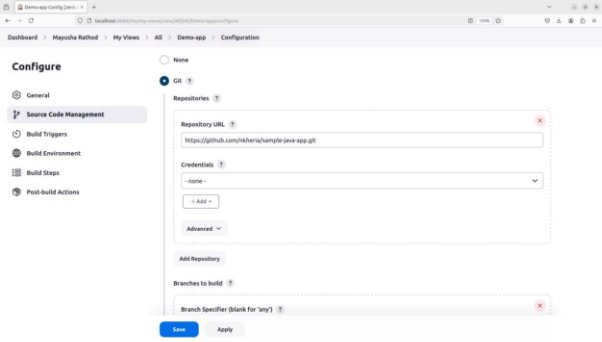

Give repo url along with .git 

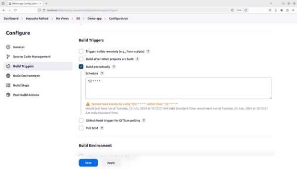

Cron job schedule 

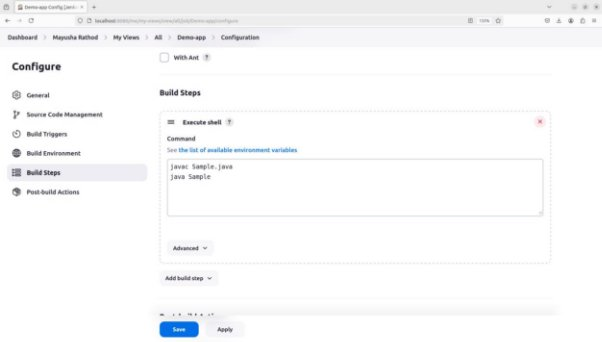

Commands to exec 

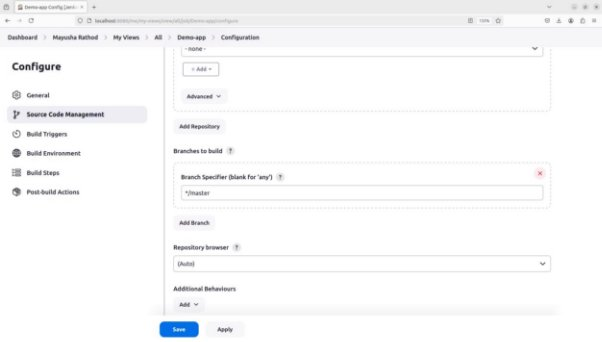

Branch to build. 

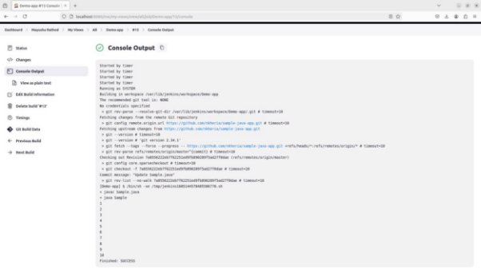

Output for master branch build 

Another branch featured 

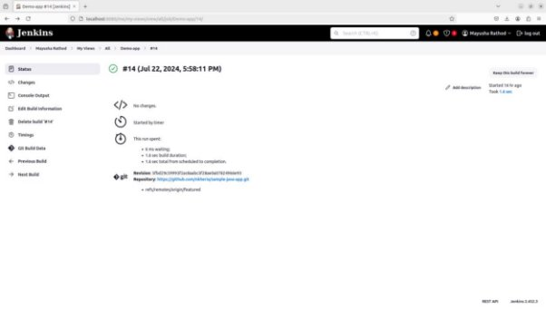

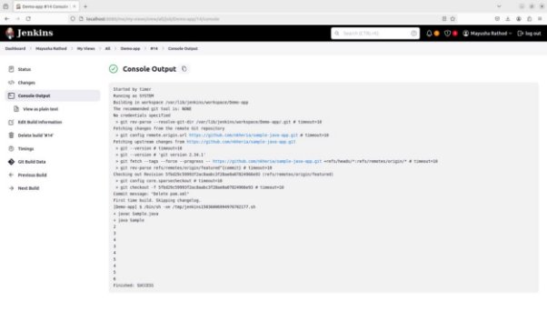

Output for featured branch 

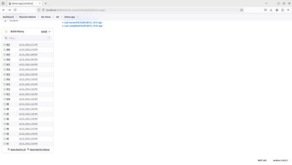

Continuous build using cron 

**Demo Jenkins app: Private repo using credentials.** 

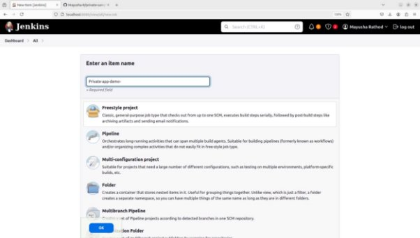

Create a new project for private git repo. 

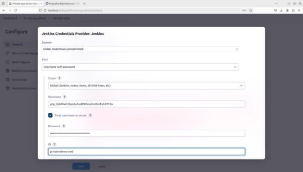

Cred added for git repo. 

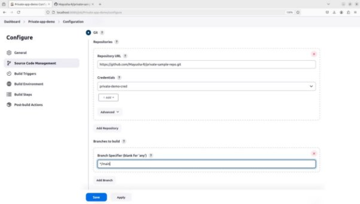

Give repo along with credentials and branch. 

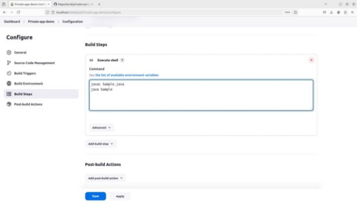

Add build steps. 

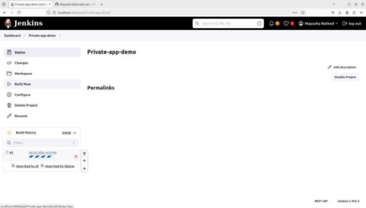

Build project. 

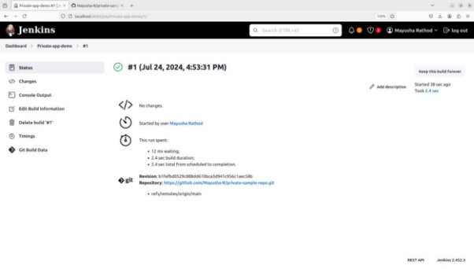

Successful build using credentials. 

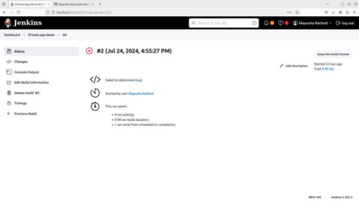

Build failed if credentials removed. 
