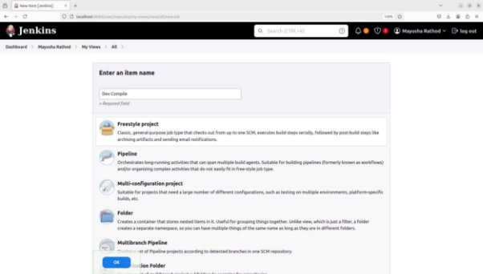
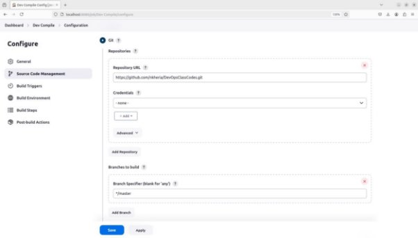
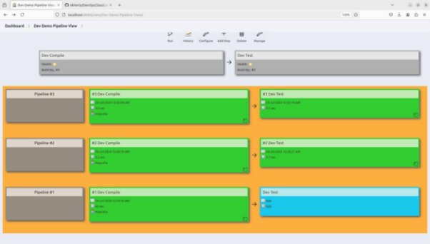

**New project using Maven:** 

added maven 3.9.0 in tools. 

create project named “Dev Compile” 

Add git repo and branch 

Add a build step that you need to perform. The Goal mentioned here is a predefined Maven goal but any other goal that we defined in the pom.xml file can be used. 

Created another project named “Dev Test” for the same repo but with a different goal in maven. 

In “Dev Compile”, add a post build action to build the “Dev Test” project after successful build of “Dev Compile”. 

“Dev Test” will be build automatically after “Dev Compile” has been build successfully.  

**Build a Pipeline View for the above projects: Dev Compile → Dev Test** 

Add the “Build Pipeline” plugin from the available plugin which is used to create the pipeline view. 

Create a new build pipeline view. 

Mention the starting project for the pipeline view which would be “Dev Compile” in our case. 

Can change display options as per requirements.  

Pipeline view when building Dev Compile. 

Pipeline view when Dev compile has successfully build and Dev Test has not yet been build. 

Pipeline view when both have been successfully build. 
