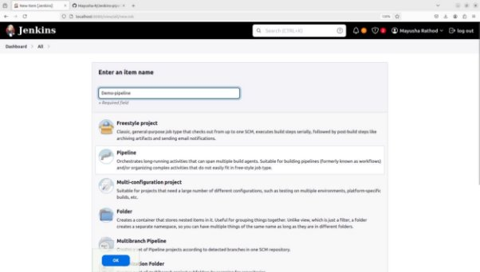

**Project 01** 

**Project Overview** 

Your organization is implementing continuous integration (CI) practices to streamline the software development lifecycle. As part of this initiative, you will create a Jenkins declarative pipeline for building a simple Maven project hosted on GitHub. This project aims to automate the build process, ensure code quality, and facilitate continuous delivery (CD). 

**Objectives** 

- Create a Jenkins pipeline script using declarative syntax. 
- Clone a Maven project from a specified GitHub repository. 
- Execute the build process and run unit tests. 
- Archive build artifacts. 
- Provide clear feedback on build status through Jenkins' UI and console output. 

**Instructions** 

1. **Setup Jenkins Job** 
- Create a new Jenkins pipeline job. 

- Configure the job to pull the Jenkinsfile from the GitHub repository. 

2. **Create Jenkinsfile** 
- Write a declarative pipeline script (Jenkinsfile) that includes the following stages: 
- **Clone Repository**: Clone the Maven project from the GitHub repository. 
- **Build**: Execute the Maven build process (mvn clean install). 
- **Test**: Run unit tests as part of the Maven build. 
- **Archive Artifacts**: Archive the build artifacts for future use. 

Public Repo: 

Private Repo : 

3. **Configure Pipeline Parameters** 
- Allow the pipeline to accept parameters such as Maven goals and options for flexibility. 
- Ensure the pipeline can be easily modified for different build configurations. 
4. **Run the Pipeline** 
- Trigger the Jenkins pipeline job manually or set up a webhook for automatic triggering on GitHub repository changes. 
- Monitor the build process through Jenkins' UI and console output. 

Public Repo output: 

Test output: 

Pipeline overview: 

Private Repo output: 

Test Output: 

