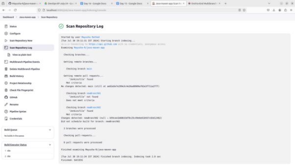

**Multi-Branch Project** 

**Project Overview** 

- Create a simple Java Maven project. 
- Version-control the project using Git with multiple branches. 
- Set up Jenkins multi-branch pipeline for automated build and deployment. 
- Utilize Jenkins environment variables in the Jenkinsfile. 

**Project Objectives** 

- Version-control using Git. 
- Jenkins multi-branch pipeline setup. 
- Environment variable management using Jenkinsfile. 

**Project Deliverables** 

1. **Git Repository:** 
- Local Git repository initialized. 
- Branches: development, staging, and production. 
- Repository pushed to remote Git server (e.g., GitHub, GitLab, Bitbucket). 
2. **Maven Project:** 
- Simple Java Maven project created (HelloWorld application). 
- pom.xml with dependencies and build configurations. 
3. **Jenkins Setup:** 
- Multi-branch pipeline job configured in Jenkins. 
- Jenkinsfile defining build and deployment steps. 
- Environment variables managed using Jenkins environment variable settings. 

Jenkinsfile in main and newbranch02 not in newbranch01 

Configuration for above output: 

Different configuration: 

Output:  

Branches build: 

