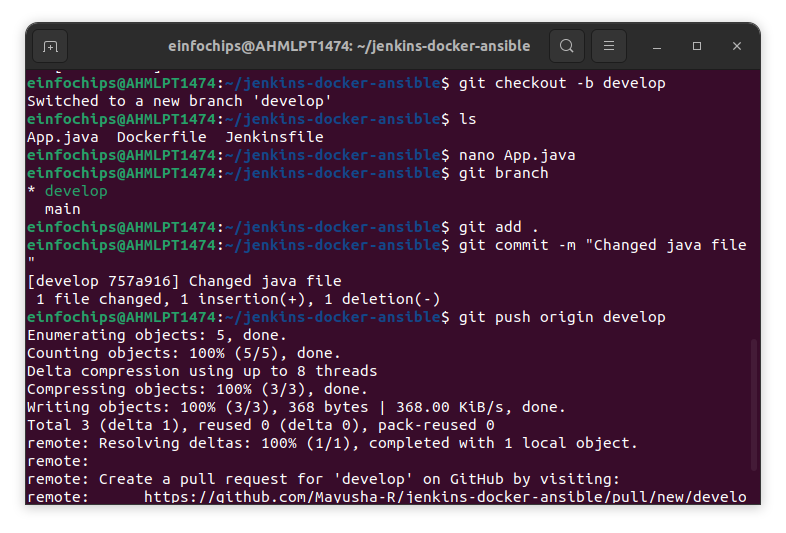
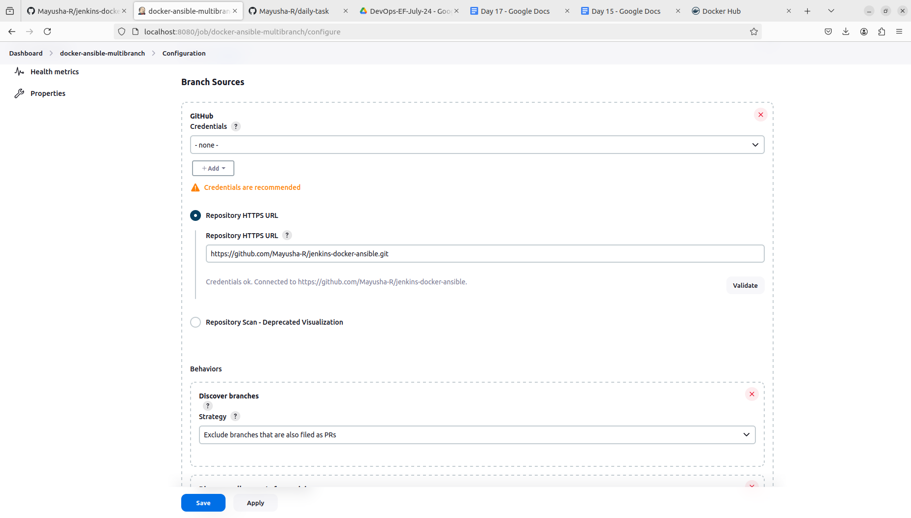
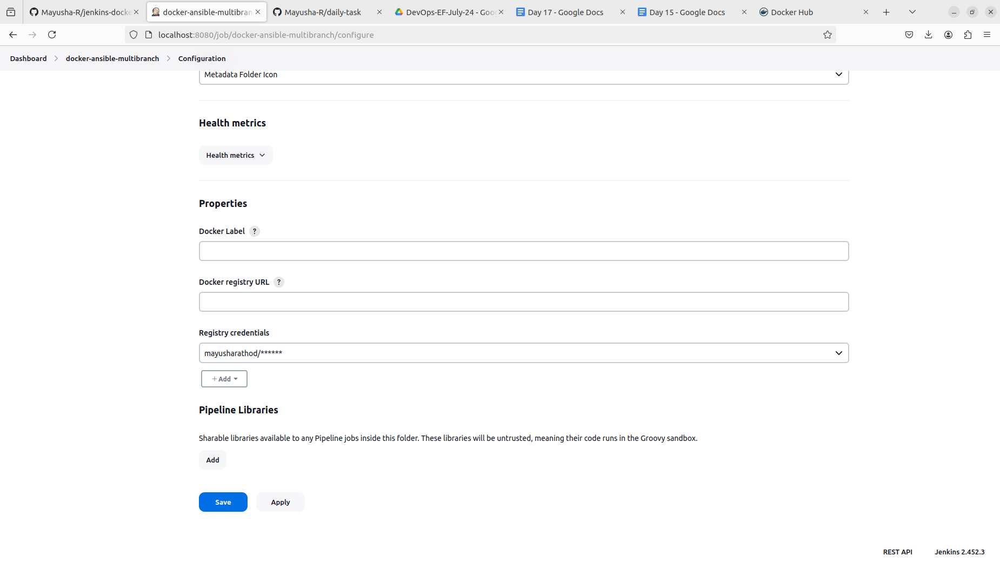
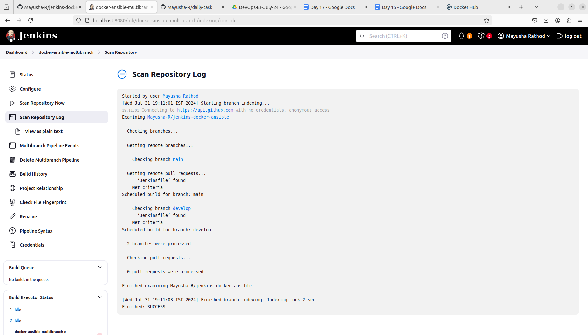
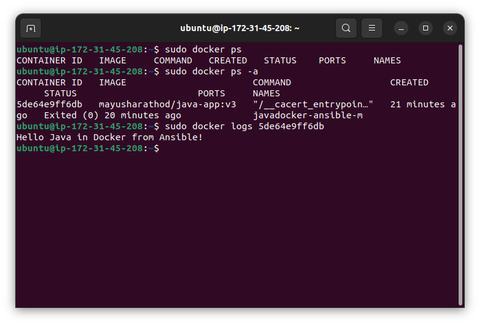

**Project Problem Statement**

A development team needs to establish a basic CI/CD pipeline for a web application. The goal is to automate version control, containerization, building, testing, and deployment processes.

**Deliverables**
    1. Git Repository:
        - Create a Git repository: Initialize a new repository for the web application.
        - Branching Strategy:
            - Set up main and develop branches.

            - Create a feature branch for a new feature or bug fix.
        - Add Configuration Files:
            - Create a .gitignore file to exclude files like logs, temporary files, etc.
            - Create a README.md file with a project description, setup instructions, and contribution guidelines.
    2. Docker Configuration:
        - Dockerfile:
            - Write a Dockerfile to define how to build the Docker image for the web application.

        - Docker Ignore File:
            - Create a .dockerignore file to exclude files and directories from the Docker build context.
        - Image Management:
            - Build a Docker image using the Dockerfile.
            - Push the built Docker image to a container registry (e.g., Docker Hub).
    3. Jenkins Configuration:
        - Jenkins Job Setup:
            - Create a Jenkins job to pull code from the Git repository.

            - Configure Jenkins to build the Docker image using the Dockerfile.
            - Set up Jenkins to run tests on the Docker image.

            - Configure Jenkins to push the Docker image to the container registry after a successful build.
        - Jenkins Pipeline:
            - Create a Jenkinsfile to define the CI/CD pipeline stages, including build, test, and deploy.

Scan Repositories:

    4. Ansible Playbook:
        - Basic Playbook Creation:
            - Develop an Ansible playbook to automate the deployment of the Docker container.
        - Playbook Tasks:
            - Install Docker on the target server (if Docker is not already installed).
            - Pull the Docker image from the container registry.
            - Run the Docker container with the required configurations.

        - Inventory File:
            - Create an inventory file specifying the target server(s) for deployment.

