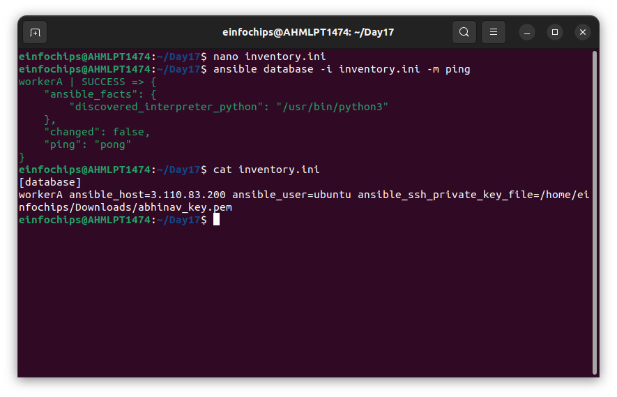
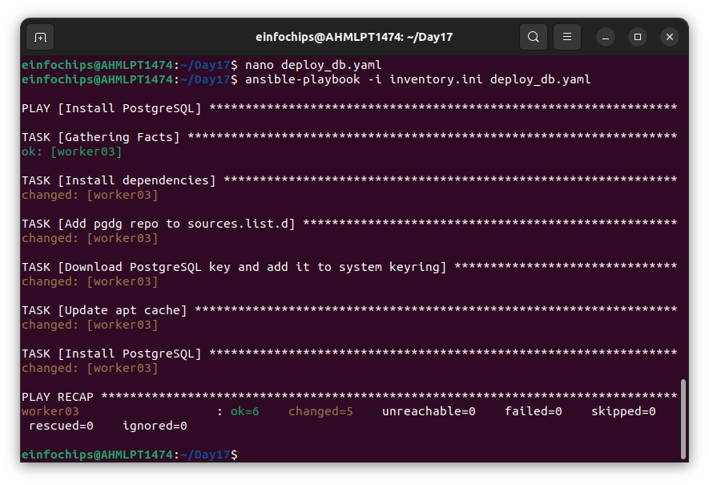
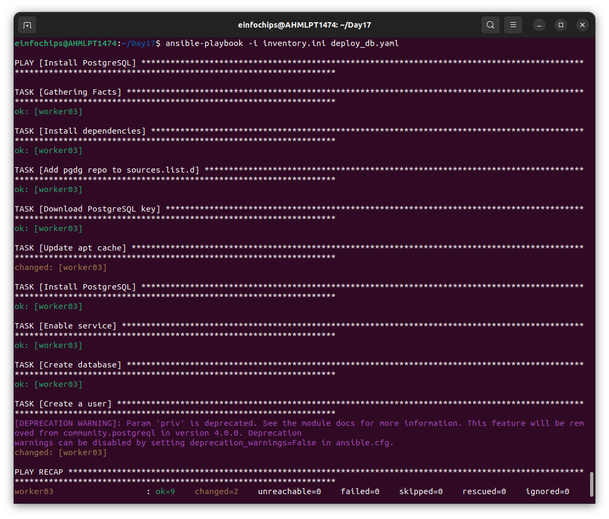
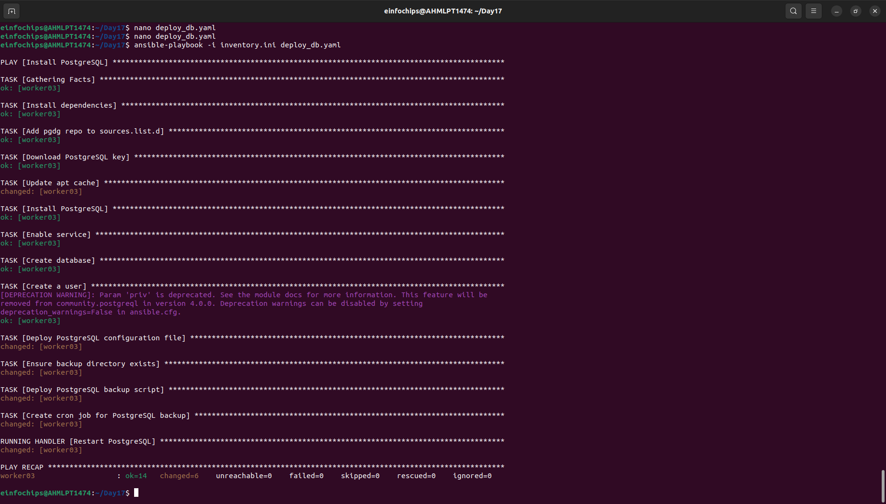
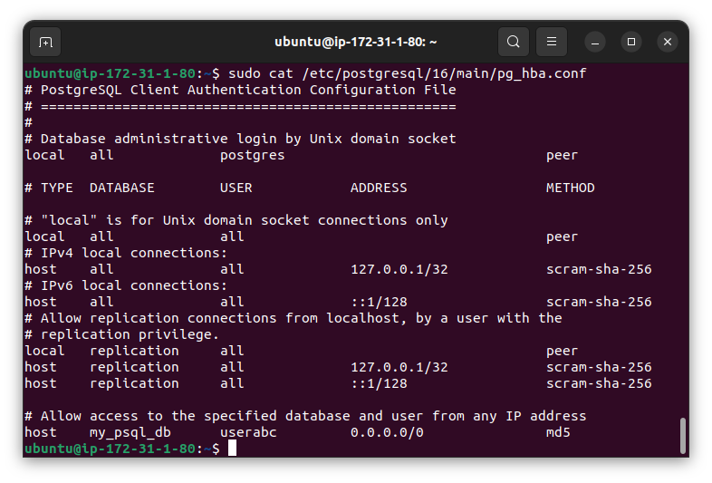

#Deploy a Database Server with Backup Automation

**Objective**: Automate the deployment and configuration of a PostgreSQL database server on an Ubuntu instance hosted on AWS, and set up regular backups.

###Problem Statement

**Objective**: Automate the deployment, configuration, and backup of a PostgreSQL database server on an Ubuntu instance using Ansible.

**Requirements:**
   1. AWS Ubuntu Instance: You have an Ubuntu server instance running on AWS.
   2. Database Server Deployment: Deploy and configure PostgreSQL on the Ubuntu instance.
   3. Database Initialization: Create a database and a user with specific permissions.
   4. Backup Automation: Set up a cron job for regular database backups and ensure that backups are stored in a specified directory.
   5. Configuration Management: Use Ansible to handle the deployment and configuration, including managing sensitive data like database passwords.

**Deliverables**
   1. Ansible Inventory File
   + Filename: inventory.ini
   + Content: Defines the AWS Ubuntu instance and connection details for Ansible.

   2. Ansible Playbook
   + Filename: deploy_database.yml
   + Content: Automates the installation of PostgreSQL, 

   + sets up the database, creates a user, 

   + and configures a cron job for backups. It also includes variables for database configuration and backup settings.
   
   3. Jinja2 Template
   + Filename: templates/pg_hba.conf.j2
   + Content: Defines the PostgreSQL configuration file (pg_hba.conf) using Jinja2 templates to manage access controls dynamically.
   
   
   4. Backup Script
   + Filename: scripts/backup.sh
   + Content: A script to perform the backup of the PostgreSQL database. This script should be referenced in the cron job defined in the playbook.

