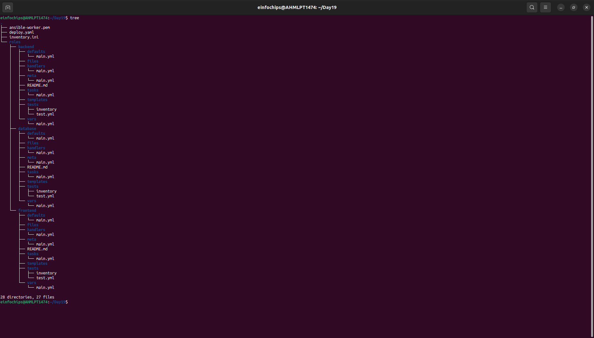
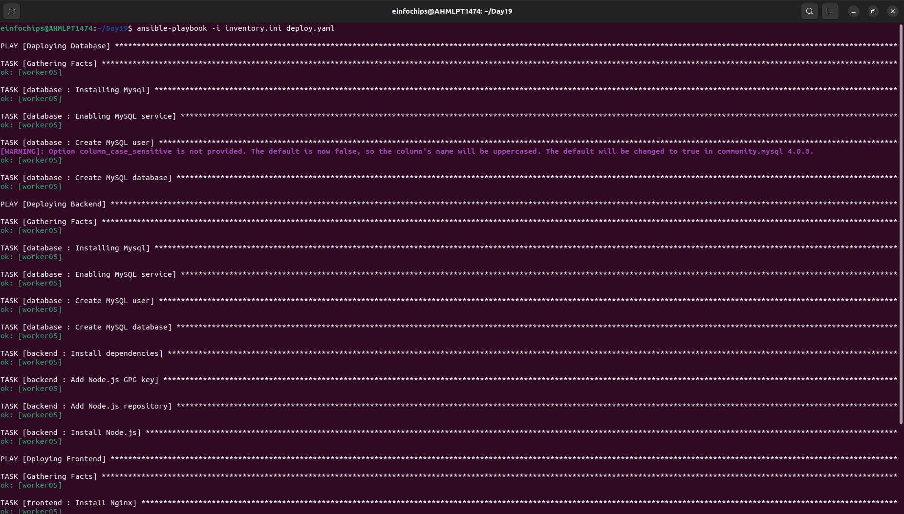
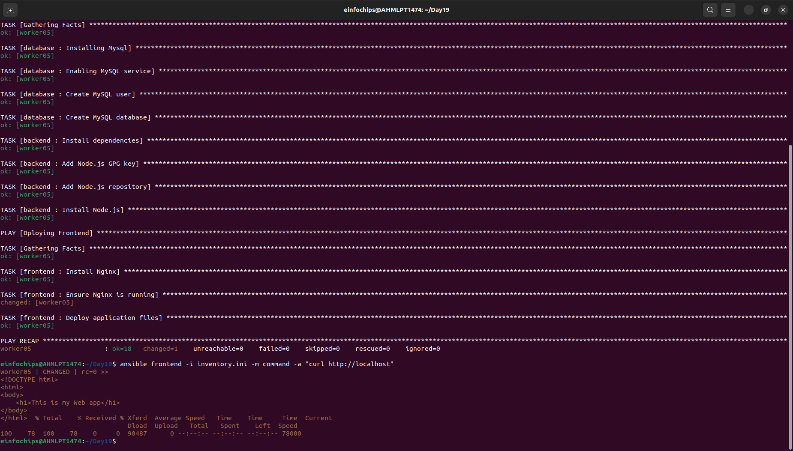

# Project 01

## Problem Statement

You are tasked with deploying a three-tier web application (frontend, backend, and database) using Ansible roles. The frontend is an Nginx web server, the backend is a Node.js application, and the database is a MySQL server. Your solution should use Ansible Galaxy roles where applicable and define appropriate role dependencies. The deployment should be automated to ensure that all components are configured correctly and can communicate with each other.

## Steps and Deliverables

### 1. Define Project Structure
- Create a new Ansible project with a suitable directory structure to organize roles, playbooks, and inventory files.

### 2. Role Selection and Creation
- Select appropriate roles from Ansible Galaxy for each tier of the application:
  - Nginx for the frontend.
  - Node.js for the backend.
  - MySQL for the database.
- Create any custom roles needed for specific configurations that are not covered by the Galaxy roles.

### 3. Dependencies Management
- Define dependencies for each role in the `meta/main.yml` file.
- Ensure that the roles have appropriate dependencies, such as ensuring the database is set up before deploying the backend.

### 4. Inventory Configuration
- Create an inventory file that defines the groups of hosts for each tier (frontend, backend, database).
- Ensure proper group definitions and host variables as needed.

### 5. Playbook Creation
- Create a playbook (`deploy.yml`) that includes and orchestrates the roles for deploying the application.
- Ensure the playbook handles the deployment order and variable passing between roles.

**Structure:**



**Playbook:**
```yaml 
---
- name: Daploying Database
  hosts: database
  become: yes
  roles:
    - database

- name: Deploying Backend
  hosts: backend
  become: yes
  roles:
    - backend

- name: Dploying Frontend
  hosts: frontend
  become: yes
  roles:
    - frontend
```

**Output:**



