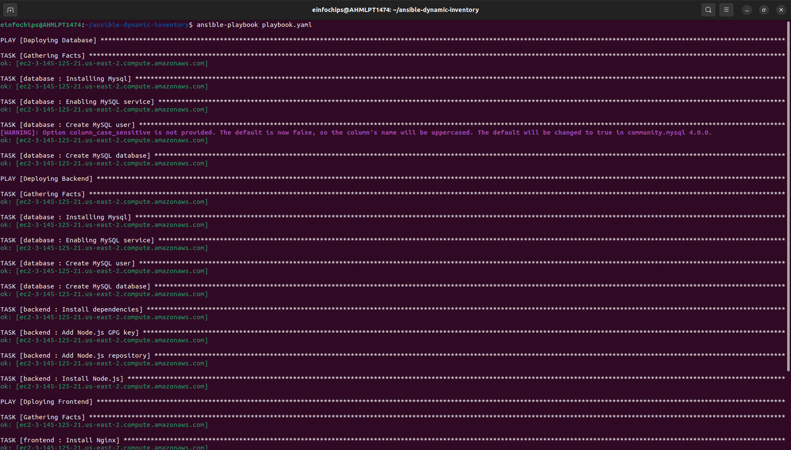
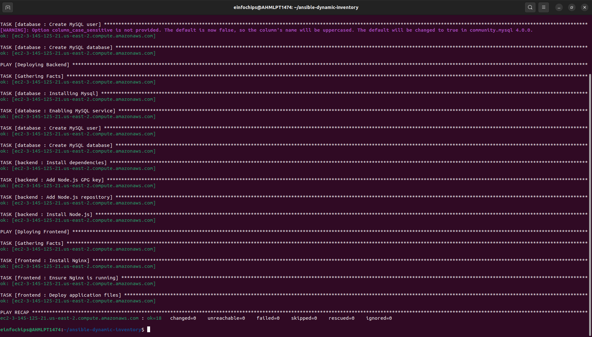

# Ansible Project for AWS Deployment

## Overview

This project involves setting up a development environment using AWS EC2 and Ansible, with the goal of deploying a web application. The project is divided into several milestones to guide the development and deployment process.

1. **Environment Setup**

**Objective:** Configure your development environment and AWS infrastructure.

**Tasks:**
- Launch an AWS EC2 instance running Ubuntu.
- Install Ansible and Git on your local machine or control node.

**Deliverables:**
- AWS EC2 instance running Ubuntu.
- Local or remote control node with Ansible and Git installed.

---

2. **Create Ansible Role Structure**

**Objective:** Organize your Ansible project using best practices for playbooks and roles.

**Tasks:**
- Use Ansible Galaxy to create roles for web server, database, and application deployment.
- Define the directory structure and initialize each role.

**Deliverables:**
- Ansible role directories for webserver, database, and application.

---

3. **Version Control with Git**

**Objective:** Implement version control for your Ansible project.

**Tasks:**
- Initialize a Git repository in your project directory.
- Create a `.gitignore` file to exclude unnecessary files.
- Commit and push the initial codebase to a remote repository.

**Deliverables:**
- Git repository with the initial Ansible codebase.
- Remote repository link (e.g., GitHub).

---

4. **Develop Ansible Roles**

**Objective:** Write Ansible roles for web server, database, and application deployment.

**Tasks:**
- Define tasks, handlers, files, templates, and variables within each role.
- Ensure each role is modular and reusable.

**Deliverables:**
- Completed Ansible roles for webserver, database, and application.

---

5. **Documentation and Maintenance**

**Objective:** Document your Ansible roles and playbooks for future maintenance.

**Tasks:**
- Create `README.md` files for each role explaining purpose, variables, tasks, and handlers.
- Add comments within your playbooks and roles to explain complex logic.

**Deliverables:**
- `README.md` files for webserver, database, and application roles.
- Well-documented playbooks and roles.

---

6. **Dynamic Inventory Script**

**Objective:** Use dynamic inventory scripts to manage AWS EC2 instances.

**Tasks:**
- Write a Python script that queries AWS to get the list of EC2 instances.
- Format the output as an Ansible inventory.

**Deliverables:**
- Dynamic inventory script to fetch EC2 instance details.

---

7. **Playbook Development and Deployment**

**Objective:** Create and execute an Ansible playbook to deploy the web application.

**Tasks:**
- Develop a master playbook that includes all roles.
- Define inventory and variable files for different environments.
- Execute the playbook to deploy the web application on the EC2 instance.

**Deliverables:**
- Ansible playbook for web application deployment.
- Successfully deployed web application on the EC2 instance.

Output:

