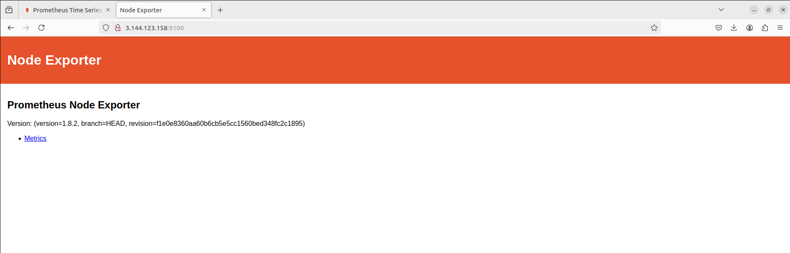
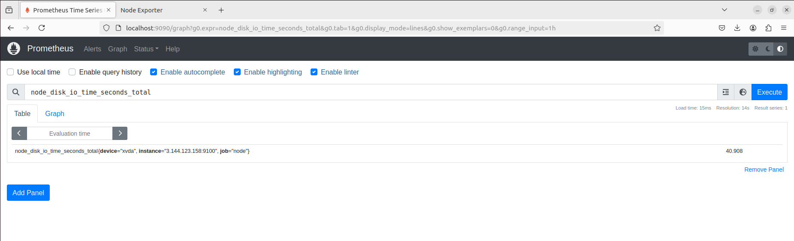
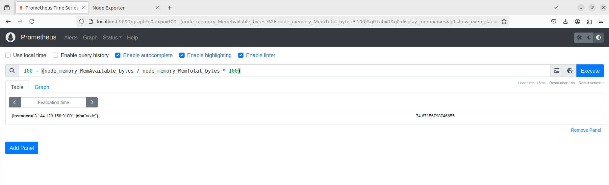

# Project 01
### Project Overview:
The goal of this capstone project is to combine shell scripting with system monitoring and log management practices. You will create a set of automated tools using shell scripts to manage logs, monitor system performance using Prometheus and Node Exporter, and generate insights using PromQL queries. The project will require a systematic approach, covering scripting fundamentals, log management, and monitoring setup.
### Project Deliverables:
1. **Shell Scripts for Basic Operations:**
    - Task: Write shell scripts to perform basic system operations, such as checking disk usage, memory usage, and CPU load.
    
    

2. **Log Management Script:**
    - Task: Develop a script to automate log management tasks such as log rotation and archiving. This script should include the ability to compress old logs and delete logs older than a specified number of days.
    
    

3. **Log Checking and Troubleshooting:**
    - Task: Write a script that reads through system and application logs, identifies common issues (e.g., out of memory, failed service starts), and provides troubleshooting steps based on log analysis.
    
    

4. **Installation and Setup of Prometheus and Node Exporter:**
    - Task: Install and configure Prometheus and Node Exporter on the system. Ensure that Node Exporter is properly configured to collect system metrics.
    
        Install and run Prometheus:
        ```bash
        wget https://github.com/prometheus/prometheus/releases/download/v2.53.1/prometheus-2.53.1.linux-amd64.tar.gz
        ```
        ```bash
        tar -xvf prometheus-2.53.1.linux-amd64.tar.gz
        ```
        ```bash
        cd prometheus-2.53.1.linux-amd64/
        ```
        ```bash
        ./prometheus 
        ```
        
    
        


        Install Node-Exporter:
        ```bash
        wget https://github.com/prometheus/node_exporter/releases/download/v1.8.2/node_exporter-1.8.2.linux-amd64.tar.gz
        ```
        ```bash
        tar -xvf node_exporter-1.8.2.linux-amd64.tar.gz
        ```
        ```bash
        cd node_exporter-1.8.2.linux-amd64/
        ```
        ```bash
        ./node_exporter 
        ```
    
        
    
        

        - A running instance of Prometheus scraping metrics from Node Exporter.

        Add the Node-Exporter job in prometheus.yml file:
        
        ```yml
        - job_name: "node"
            static_configs:
            - targets: ["<instance-ip>:9100"]
        ```
        Reaload Prometheus:
        ```bash
        kill -HUP $(pgrep prometheus)
        ```
        

5. **Prometheus Query Language (PromQL) Basic Queries:**
    - Task: Create a series of PromQL queries to monitor system performance, such as CPU usage, memory usage, and disk I/O.

        ```
        rate(node_cpu_seconds_total[5m])
        ```
        

        ```
        node_disk_io_time_seconds_total
        ```
        
        

        ```
        100 - (node_memory_MemAvailable_bytes / node_memory_MemTotal_bytes * 100)
        ```

        