# Project 01

### Project Breakdown
1. **Configuring Jobs and Targets**
    - Task: Set up a Prometheus server to monitor multiple services running on different nodes.
    
    Install and run Prometheus:
    ```bash
    wget https://github.com/prometheus/prometheus/releases/download/v2.53.1/prometheus-2.53.1.linux-amd64.tar.gz
    ```
    ```bash
    tar -xvf prometheus-2.53.1.linux-amd64.tar.gz
    ```
    ```bash
    cd prometheus-2.53.1.linux-amd64/
    ```
    ```bash
    ./prometheus 
    ```
    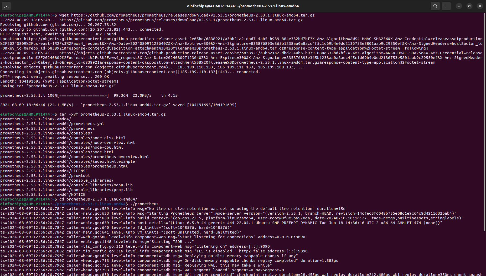

    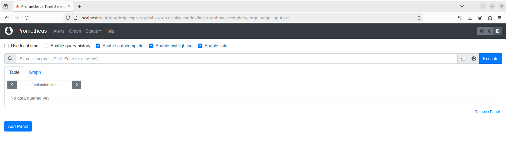

2. **Using Exporters (Node Exporter)**
    - Task: Use Node Exporter to monitor system-level metrics like CPU, memory, disk usage, and network statistics.
    
    Install Node-Exporter:
    ```bash
    wget https://github.com/prometheus/node_exporter/releases/download/v1.8.2/node_exporter-1.8.2.linux-amd64.tar.gz
    ```
    ```bash
    tar -xvf node_exporter-1.8.2.linux-amd64.tar.gz
    ```
    ```bash
    cd node_exporter-1.8.2.linux-amd64/
    ```
    ```bash
    ./node_exporter 
    ```

    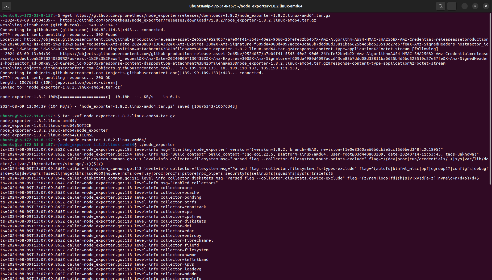

    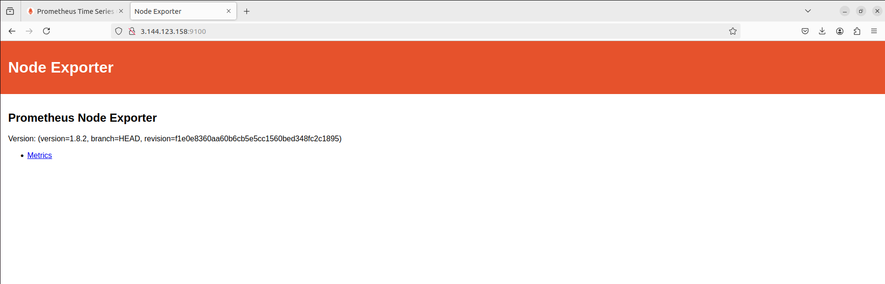

3. **Hands-on Exercise: Setting Up Exporters**
    - Task: Configure at least two different types of exporters (e.g., Node Exporter and MySQL Exporter) and integrate them with Prometheus.
    
    Add the Node-Exporter job in prometheus.yml file:

    ```yml
    - job_name: "node"
      static_configs:
        - targets: ["<instance-ip>:9100"]
    ```
    Reaload Prometheus:
    ```bash
    kill -HUP $(pgrep prometheus)
    ```
    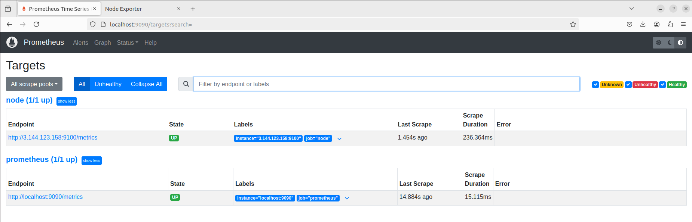

4. **Introduction to PromQL**
    - Task: Learn and implement basic PromQL queries to extract meaningful data from the metrics collected.
    ```
    node_disk_io_time_seconds_total
    ```
    
    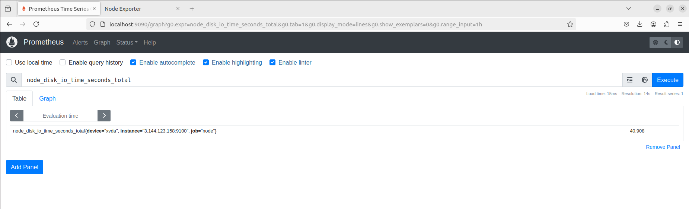

5. **Basic Queries (Selectors, Functions, Operators)**
    - Task: Create PromQL queries using selectors, functions, and operators to filter and manipulate time-series data.

    ```
    rate(node_cpu_seconds_total[5m])
    ```
    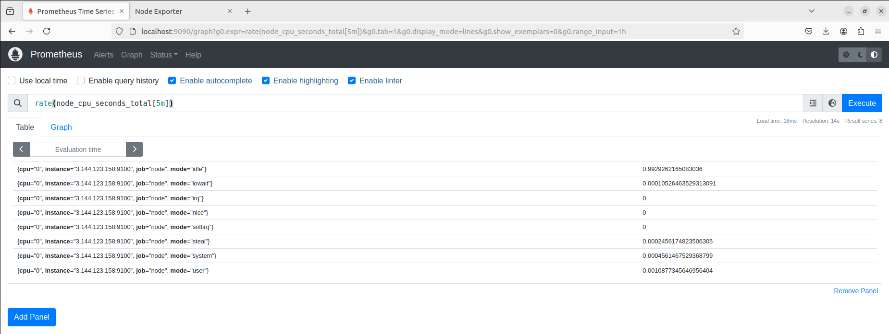


6. **Advanced Queries and Aggregations**
    - Task: Perform advanced data aggregation using PromQL.
    ```
    100 - (node_memory_MemAvailable_bytes / node_memory_MemTotal_bytes * 100)
    ```

    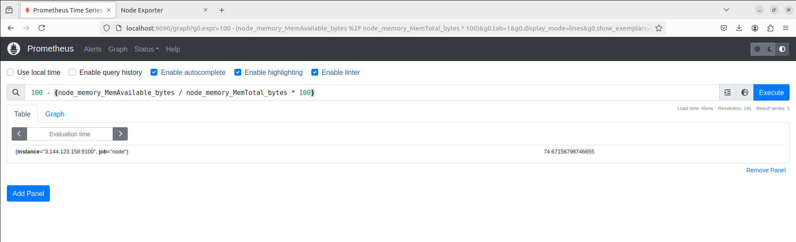

7. **Configuring Alertmanager**
    - Task: Set up Alertmanager to handle alerts generated by Prometheus.
    ```bash
    wget https://github.com/prometheus/alertmanager/releases/download/v0.27.0/alertmanager-0.27.0.linux-amd64.tar.gz
    ```
    ```bash
    tar -xvf alertmanager-0.27.0.linux-amd64.tar.gz
    ```
    ```bash
    cd alertmanager-0.27.0.linux-amd64/
    ```
    ```bash
    ./alertmanager
    ```

    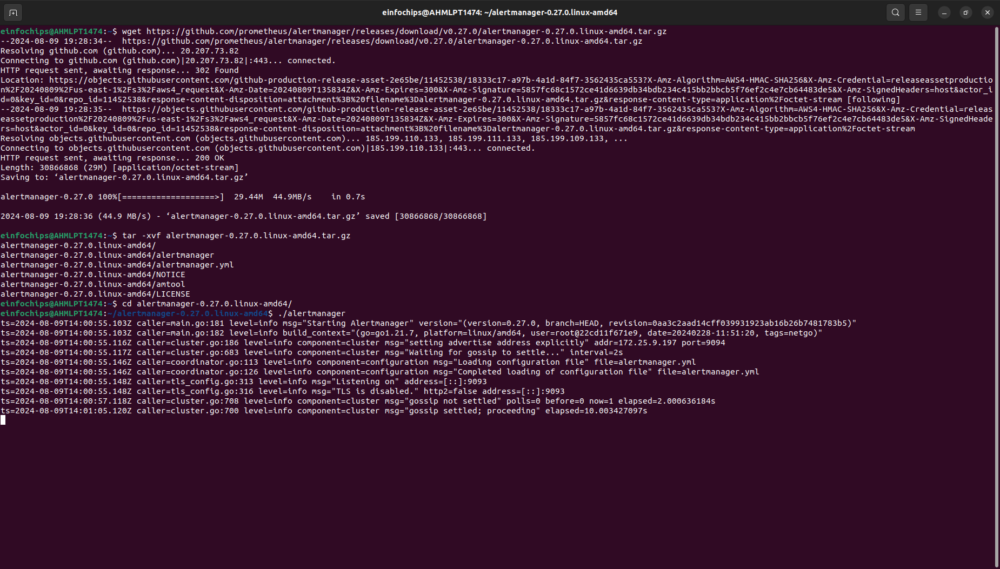

    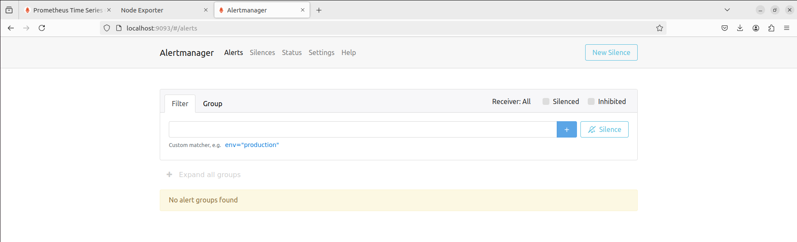

    Add AlertManager in prometheus.yml file:
    ```yml
    alerting:
        alertmanagers:
          - static_configs:
              - targets:
                  - localhost:9093

    ```

8. **Writing Alerting Rules**
    - Task: Write custom alerting rules in Prometheus to trigger alerts based on specific conditions.
    
    rules/rule.yml:
    ```yml
    ---
    groups:
    - name: NodeAlert
      rules:
        - alert: NodeExporterDown
          expr: up{job="node"}==0
    
    - name: CPUAlert
      rules:
        - alert: HighCpuUsage
          expr: sum(rate(node_cpu_seconds_total{mode!="idle"}[5m])) by (instance) > 0.9
          for: 5m
          labels:
            severity: critical
          annotations:
            summary: "High CPU usage detected on {{ $labels.instance }}"
            description: "CPU usage is above 90% for more than 5 minutes."
    
    - name: DiskSpaceAlert
      rules:
        - alert: DiskSpaceLow
          expr: 1 - (node_filesystem_free_bytes / node_filesystem_size_bytes) > 0.8
          for: 10m
          labels:
            severity: critical
          annotations:
            summary: "Low disk space on {{ $labels.instance }}"
            description: "Disk usage is above 80% for more than 10 minutes."
    ```

    Add rules file in prometheus.yml file:

    ```yml
    rule_files:
      - "rules/rule.yml"
    ```
    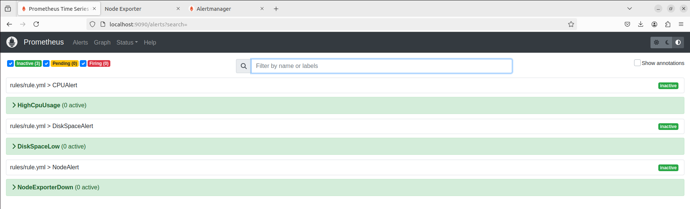


9. **Setting Up Notification Channels (Email, Slack, etc.)**
    - Task: Integrate Alertmanager with multiple notification channels like Email and Slack.
    
    alertmanager.yml:
    ```yml
    route:
      receiver: 'admin'
      routes:
        - match:
            severity: 'critical'
          receiver: 'critical_alerts'
          continue: true

        - receiver: 'admin'

    receivers:
      - name: 'critical_alerts'
        email_configs:
          - to: 'mayraym9@gmail.com'
            from: 'mayraym9@gmail.com'
            smarthost: 'smtp.example.com:587'
            auth_username: 'mayraym9@gmail.com'
            auth_identity: 'mayraym9@gmail.com'
            auth_password: '<password>'

      - name: 'admin'
        slack_configs:
          - api_url: '<slack-webhook-url>'
            channel: '#promalerts'
    ```

10. **Hands-on Exercise: Creating Alerts**
    - Task: Test the entire alerting pipeline by creating and triggering custom alerts.

    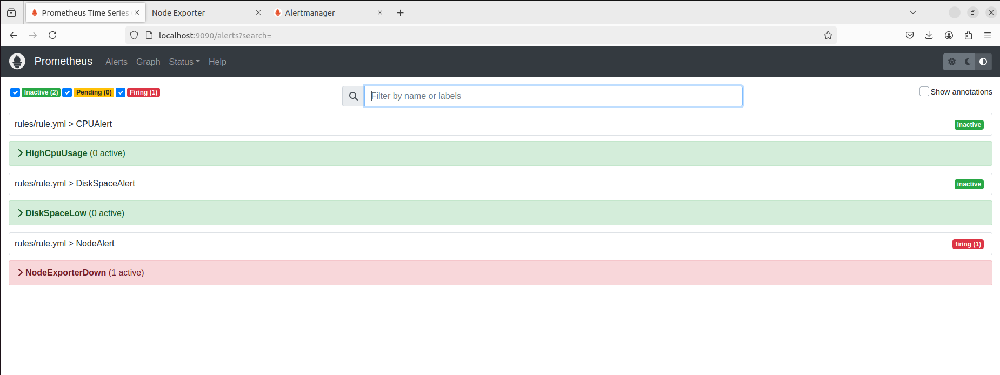

    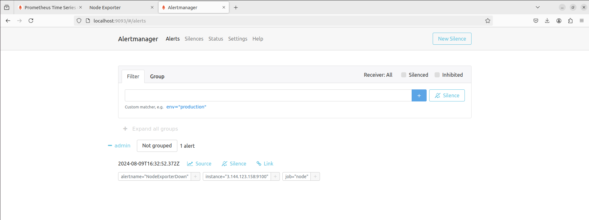

    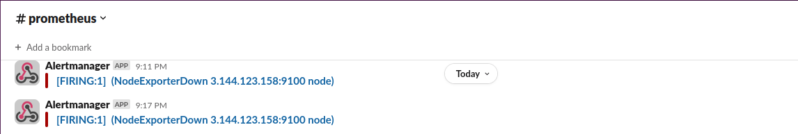
