# Comprehensive AWS S3 Management and Static Website Hosting

## Objective:

To test your knowledge and skills in managing AWS S3 storage classes, lifecycle management, bucket policies, access control lists (ACLs), and hosting a static website on S3. You will apply their understanding in a practical scenario, ensuring you have mastered the critical aspects of AWS S3.

## Project Scenario:

You are tasked with creating and managing an S3 bucket for a fictional company, "TechVista Inc.," that hosts a static website for displaying their product portfolio. The website will have different types of content, including high-resolution images, which require careful storage management to optimize costs. Additionally, the company has strict security requirements for accessing the content.

## Project Steps and Deliverables:

1. Create and Configure an S3 Bucket:

   - Create an S3 bucket named techvista-portfolio-[your-initials].

      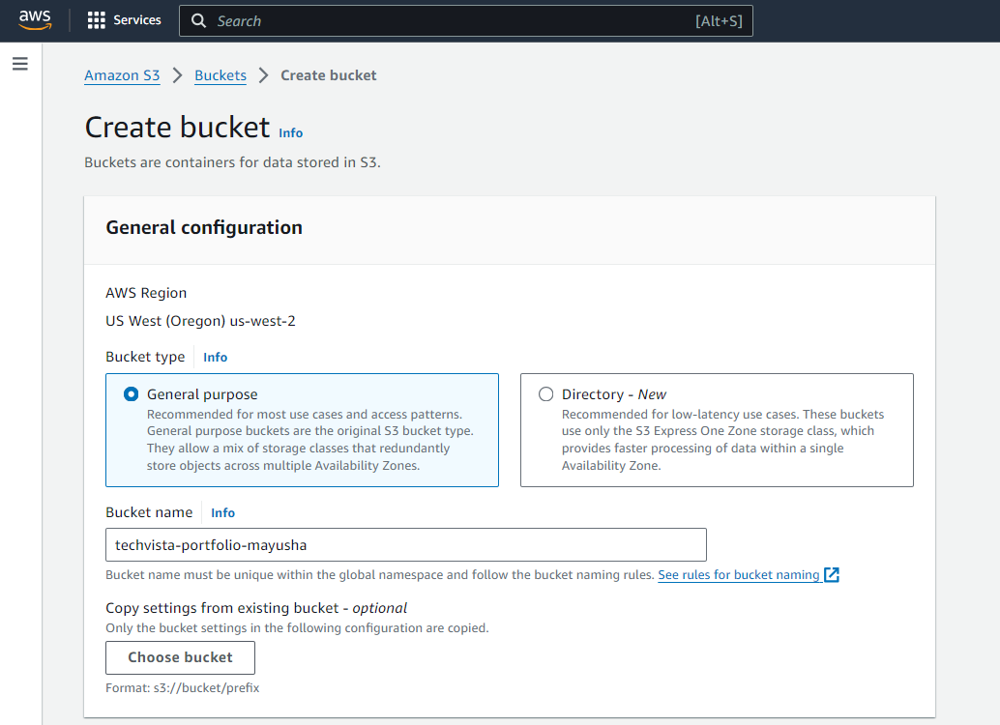

      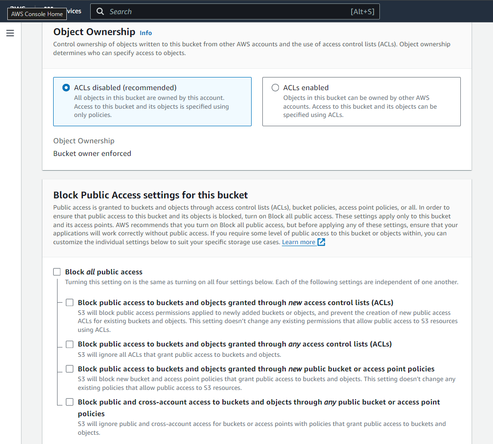

   - Enable versioning on the bucket.

      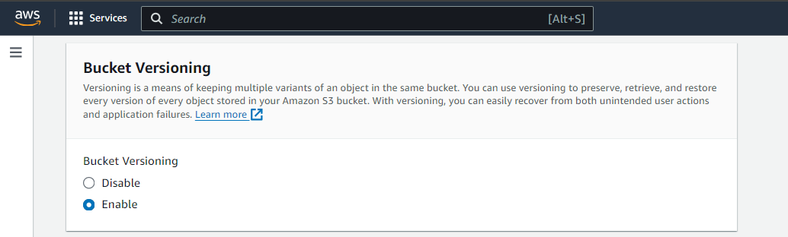

   - Set up the bucket for static website hosting.

      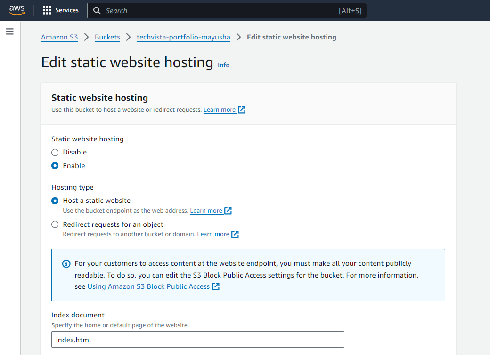

   - Upload the provided static website files (HTML, CSS, images).

      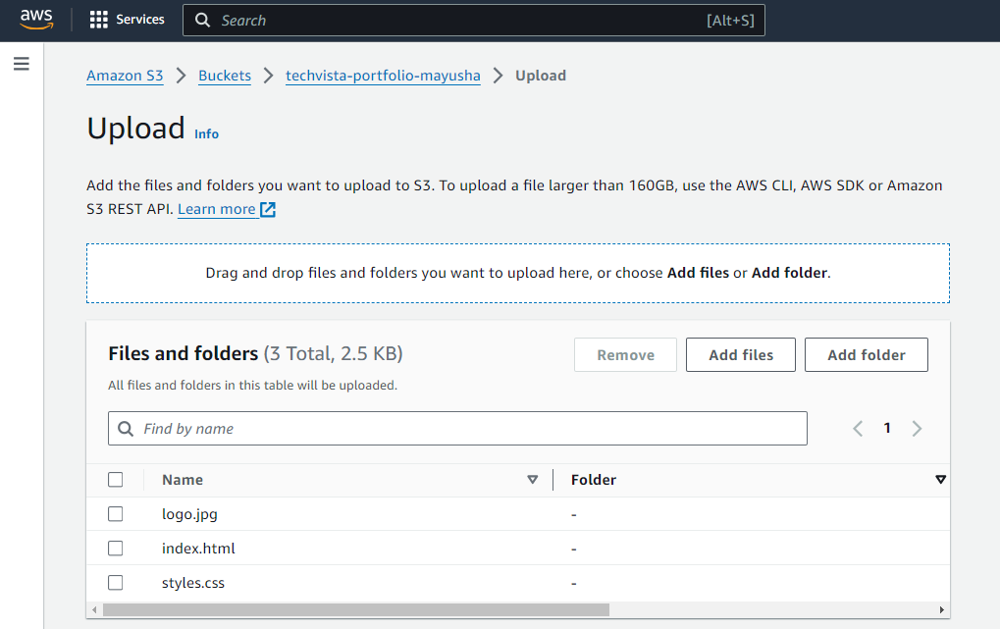

   - Ensure the website is accessible via the S3 website URL.

      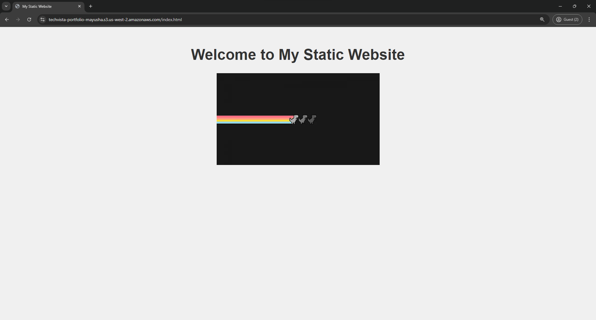

2. Implement S3 Storage Classes:

   - Classify the uploaded content into different S3 storage classes (e.g., Standard, Intelligent-Tiering, Glacier).

      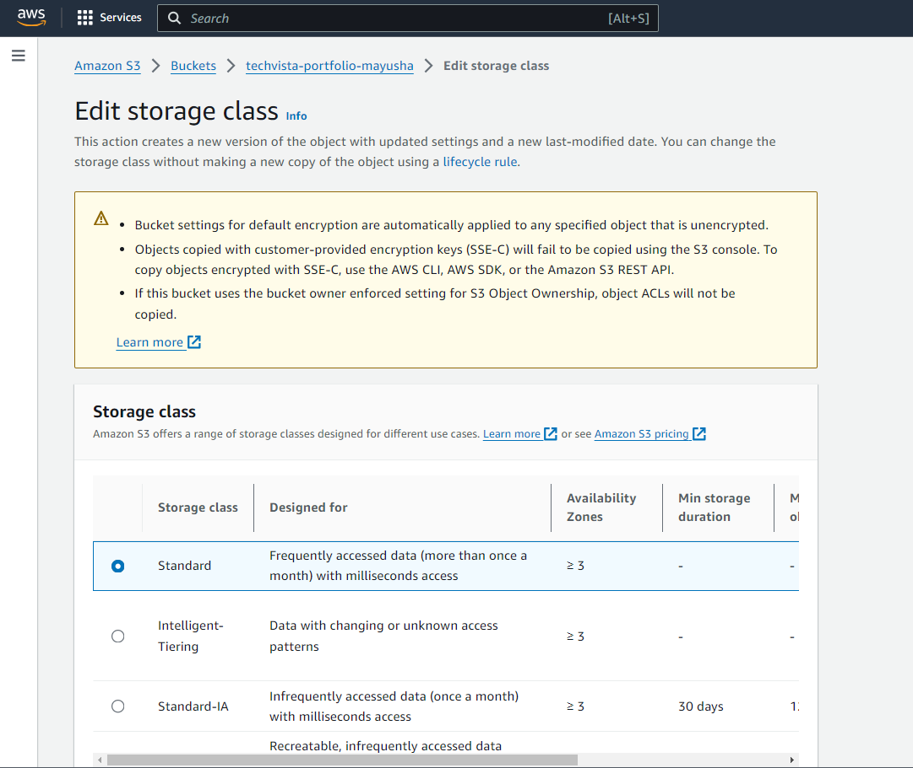

   - Justify your choice of storage class for each type of content (e.g., HTML/CSS files vs. images).

3. Lifecycle Management:

   - Create a lifecycle policy that transitions older versions of objects to a more cost-effective storage class (e.g., Standard to Glacier).
   - Set up a policy to delete non-current versions of objects after 90 days.

      

      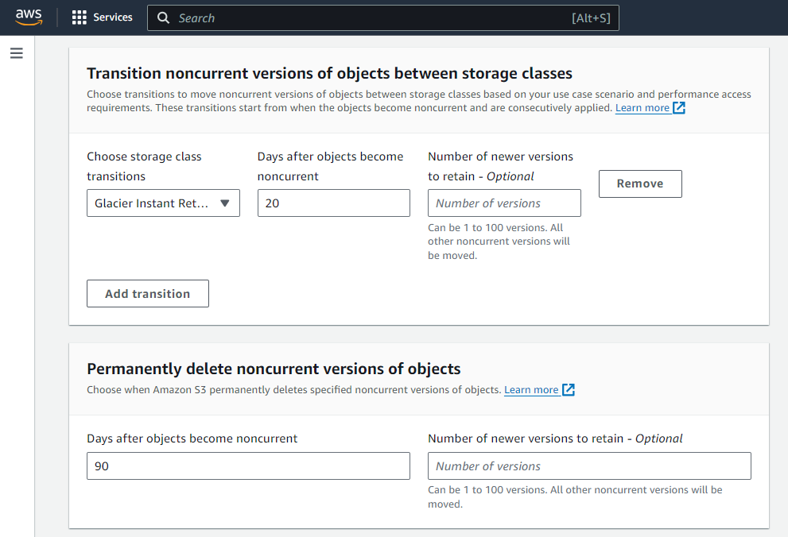

   - Verify that the lifecycle rules are correctly applied.

      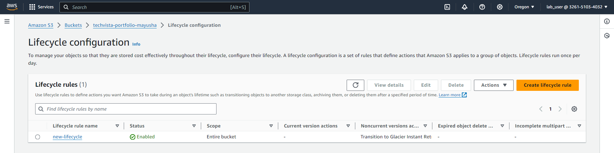

4. Configure Bucket Policies and ACLs:

   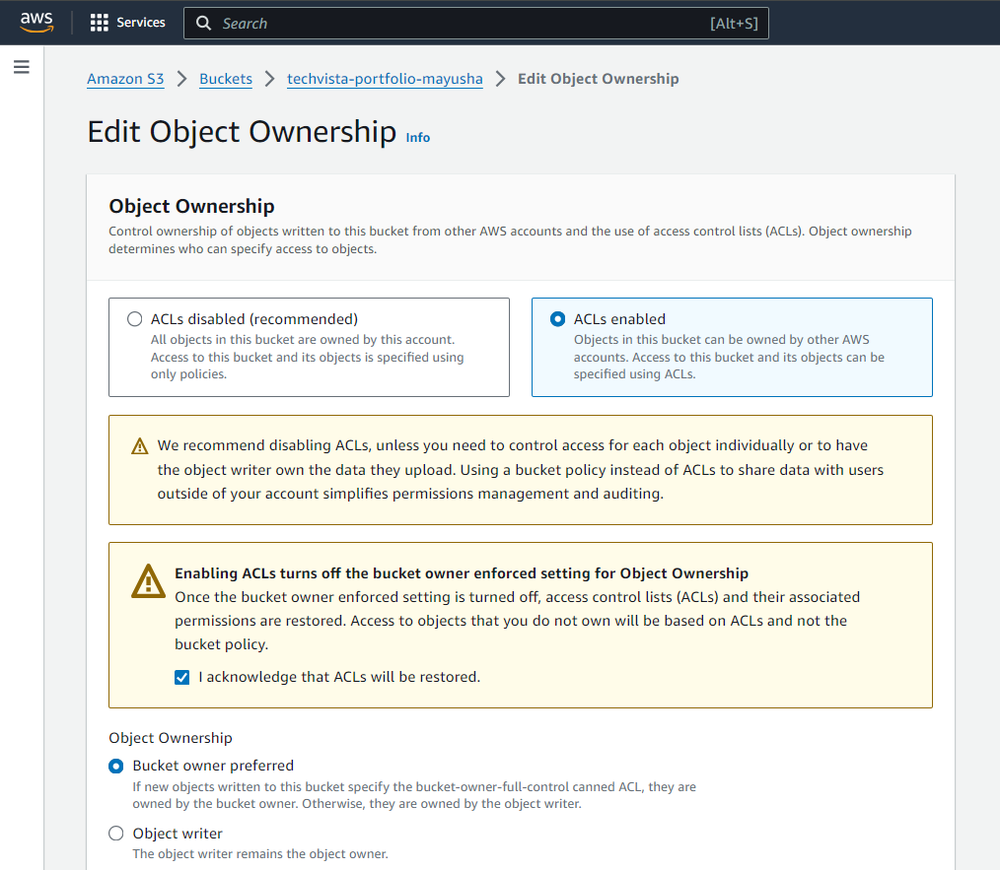

   - Create and attach a bucket policy that allows read access to everyone for the static website content.

      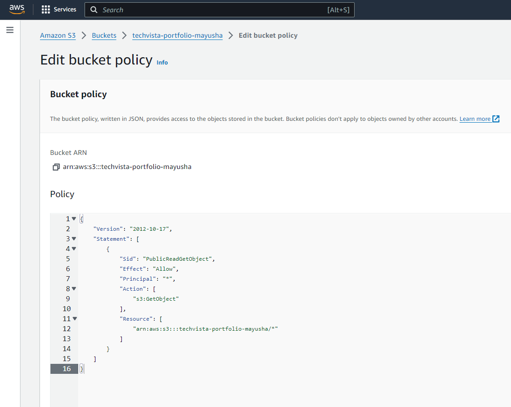

   - Restrict access to the S3 management console for specific IAM users using the bucket policy.
   
      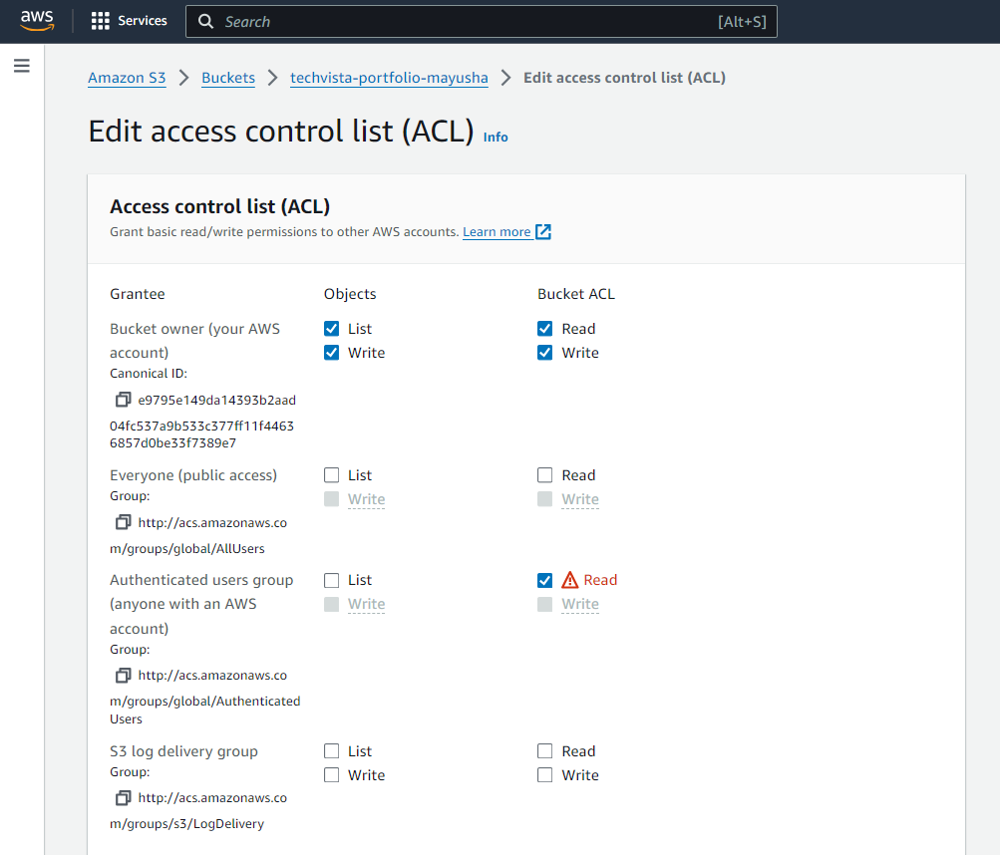
