# Project: Deploying a Multi-Tier Architecture Application using CloudFormation

## Project Objective:

This project will test your ability to deploy a multi-tier architecture application using AWS CloudFormation. The deployment should include an EC2 instance, an S3 bucket, a MySQL DB instance in RDS, and a VPC, all within the specified constraints.

## Project Overview:

You are required to design and deploy a multi-tier application using AWS CloudFormation. The architecture will include the following components:
- **EC2 Instance:** Serve as the web server.
- **S3 Bucket:** Store static assets or configuration files.
- **RDS MySQL DB Instance:** Serve as the database backend.
- **VPC:** Ensure secure communication between the components.

**Key Tasks:**
1. **Create a CloudFormation Template:**
    - VPC and Subnets:
        - Define a VPC with one public and one private subnet.
        - Attach an Internet Gateway to the VPC for public subnet access.
    - Security Groups:
        - Create a security group for the EC2 instance, allowing SSH and HTTP access from a specific IP range.
        - Create a security group for the RDS instance, allowing MySQL access from the EC2 instance only.
    - EC2 Instance:
        - Launch a t2.micro EC2 instance in the public subnet.
        - Configure the instance to access the S3 bucket and connect to the RDS instance.
    - S3 Bucket:
        - Create an S3 bucket for storing static assets or configuration files.
        - Ensure the EC2 instance has the necessary IAM role and permissions to access the S3 bucket.
    - RDS MySQL DB Instance:
        - Launch a t3.micro MySQL database in the private subnet.
        - Configure the security group to allow access only from the EC2 instance.

    ```yml

    AWSTemplateFormatVersion: '2010-09-09'
    Description: Deploy a multi-tier application with an EC2 instance, an S3 bucket, a MySQL DB instance in RDS, and a VPC.

    Parameters:
      VpcCidr:
        Description: CIDR block for the VPC
        Type: String
        Default: "10.0.0.0/16"

      PublicSubnetCidr1:
        Description: CIDR block for public subnet 1
        Type: String
        Default: "10.0.1.0/24"

      PublicSubnetCidr2:
        Description: CIDR block for public subnet 2
        Type: String
        Default: "10.0.3.0/24"

      PrivateSubnetCidr1:
        Description: CIDR block for private subnet 1
        Type: String
        Default: "10.0.2.0/24"

      PrivateSubnetCidr2:
        Description: CIDR block for private subnet 2
        Type: String
        Default: "10.0.4.0/24"

      EC2InstanceType:
        Description: EC2 instance type
        Type: String
        Default: t2.micro

      AMIId:
        Type: String
        Description: The AMI ID for the EC2 instance.
        Default: 'ami-05134c8ef96964280'

      DBInstanceType:
        Description: RDS instance type
        Type: String
        Default: db.t3.micro

      DBUsername:
        Description: The username for the RDS instance
        Type: String
        NoEcho: true
        Default: admin

      DBPassword:
        Description: The master password for the RDS instance
        Type: String
        NoEcho: true

      S3BucketName:
        Type: String
        Description: Unique name for the S3 bucket.

    Resources:
      MyVPC:
        Type: AWS::EC2::VPC
        Properties:
          CidrBlock: !Ref VpcCidr
          Tags:
            - Key: Name
              Value: MyVPC

      PublicSubnet1:
        Type: AWS::EC2::Subnet
        Properties:
          VpcId: !Ref MyVPC
          CidrBlock: !Ref PublicSubnetCidr1
          AvailabilityZone: !Select [0, !GetAZs '']
          MapPublicIpOnLaunch: true
          Tags:
            - Key: Name
              Value: PublicSubnet1

      PublicSubnet2:
        Type: AWS::EC2::Subnet
        Properties:
          VpcId: !Ref MyVPC
          CidrBlock: !Ref PublicSubnetCidr2
          AvailabilityZone: !Select [1, !GetAZs '']
          MapPublicIpOnLaunch: true
          Tags:
            - Key: Name
              Value: PublicSubnet2

      PrivateSubnet1:
        Type: AWS::EC2::Subnet
        Properties:
          VpcId: !Ref MyVPC
          CidrBlock: !Ref PrivateSubnetCidr1
          AvailabilityZone: !Select [0, !GetAZs '']
          Tags:
            - Key: Name
              Value: PrivateSubnet1

      PrivateSubnet2:
        Type: AWS::EC2::Subnet
        Properties:
          VpcId: !Ref MyVPC
          CidrBlock: !Ref PrivateSubnetCidr2
          AvailabilityZone: !Select [1, !GetAZs '']
          Tags:
            - Key: Name
              Value: PrivateSubnet2

      MyInternetGateway:
        Type: AWS::EC2::InternetGateway
        Properties:
          Tags:
            - Key: Name
              Value: MyInternetGateway

      VPCGatewayAttachment:
        Type: AWS::EC2::VPCGatewayAttachment
        Properties:
          VpcId: !Ref MyVPC
          InternetGatewayId: !Ref MyInternetGateway

      EC2SecurityGroup:
        Type: AWS::EC2::SecurityGroup
        Properties:
          VpcId: !Ref MyVPC
          GroupDescription: Allow HTTP access
          SecurityGroupIngress:
            - IpProtocol: tcp
              FromPort: 80
              ToPort: 80
              CidrIp: 0.0.0.0/0

      RDSSecurityGroup:
        Type: AWS::EC2::SecurityGroup
        Properties:
          VpcId: !Ref MyVPC
          GroupDescription: Allow MySQL access from EC2 only
          SecurityGroupIngress:
            - IpProtocol: tcp
              FromPort: 3306
              ToPort: 3306
              SourceSecurityGroupId: !Ref EC2SecurityGroup

      MyEC2Instance:
        Type: AWS::EC2::Instance
        Properties:
          InstanceType: !Ref EC2InstanceType
          ImageId: !Ref AMIId
          SubnetId: !Ref PublicSubnet1
          SecurityGroupIds:
            - !Ref EC2SecurityGroup
          UserData:
            Fn::Base64: !Sub |
              #!/bin/bash
              apt-get update
              apt install -y apache2
              systemctl start apache2
              systemctl enable apache2

      MyRDSDBInstance:
        Type: AWS::RDS::DBInstance
        Properties:
          DBInstanceClass: !Ref DBInstanceType
          Engine: MySQL
          MasterUsername: !Ref DBUsername
          MasterUserPassword: !Ref DBPassword
          DBInstanceIdentifier: mydatabase
          AllocatedStorage: 20
          VPCSecurityGroups:
            - !Ref RDSSecurityGroup
          DBSubnetGroupName: !Ref DBSubnetGroup

      DBSubnetGroup:
        Type: AWS::RDS::DBSubnetGroup
        Properties:
          DBSubnetGroupDescription: Subnet group for RDS
          SubnetIds:
            - !Ref PrivateSubnet1
            - !Ref PrivateSubnet2

      MyS3Bucket:
        Type: AWS::S3::Bucket
        Properties:
          BucketName: !Ref S3BucketName

    ```

2. **Deploy the Application:**
    - Deploy the CloudFormation stack using the template created.
    - Verify that all components are correctly configured and operational.
    - Ensure the EC2 instance can communicate with the RDS instance and access the S3 bucket.

    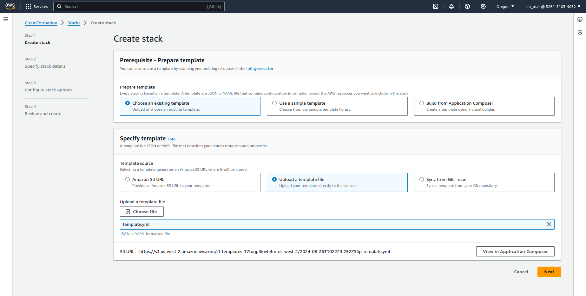

    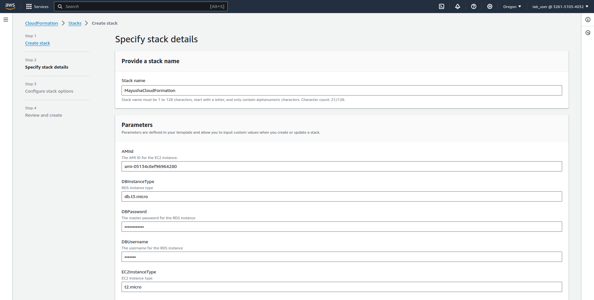

    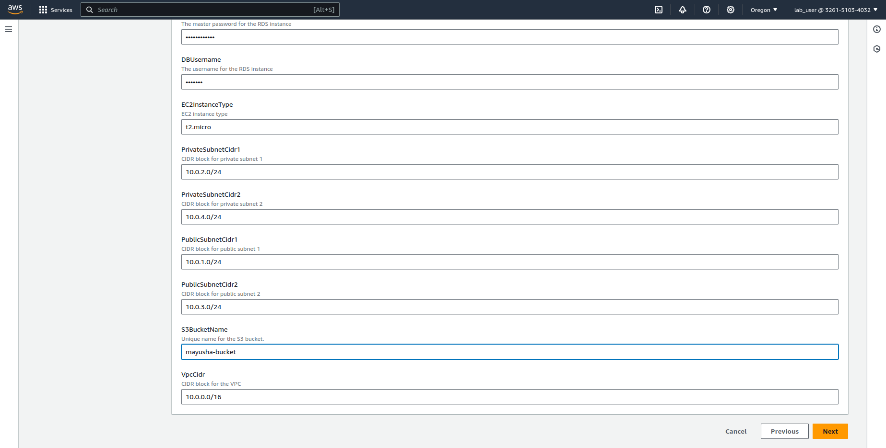

    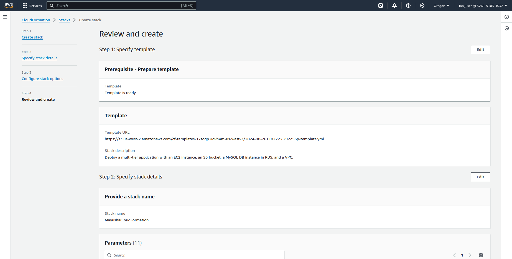

    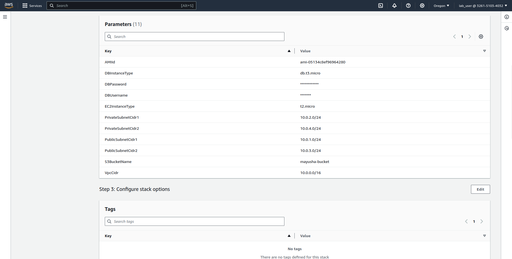

    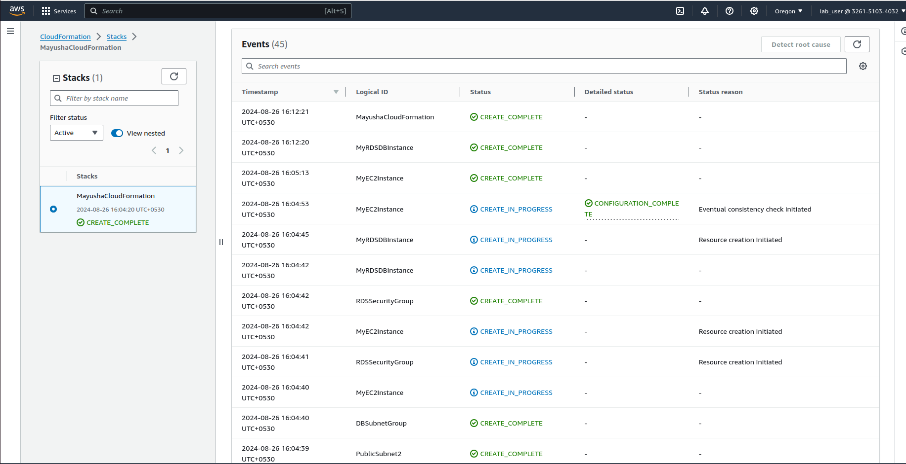

    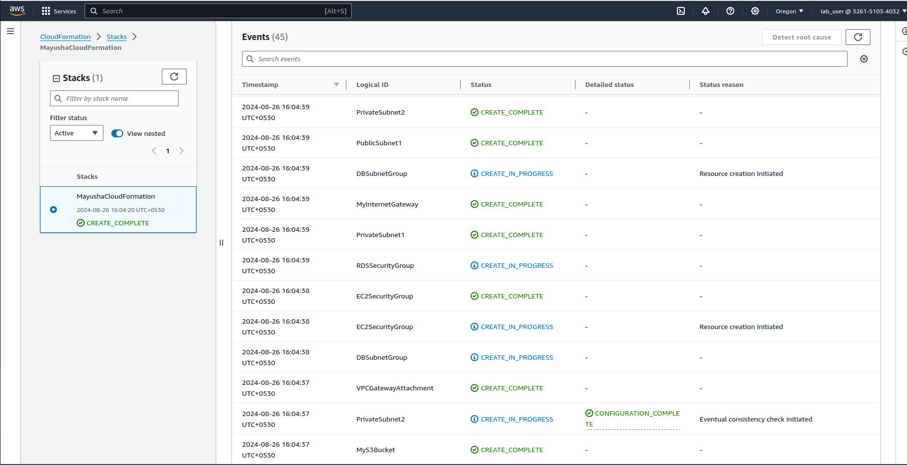

    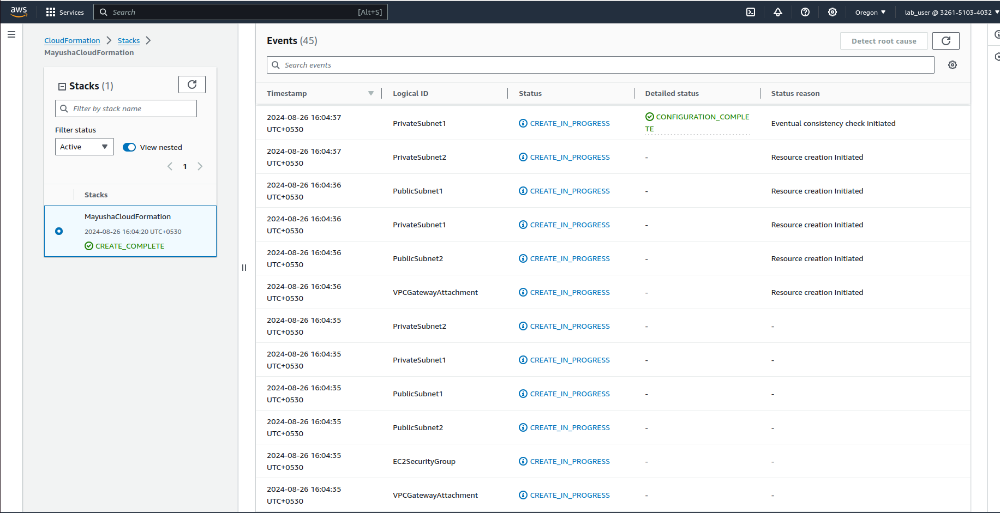

    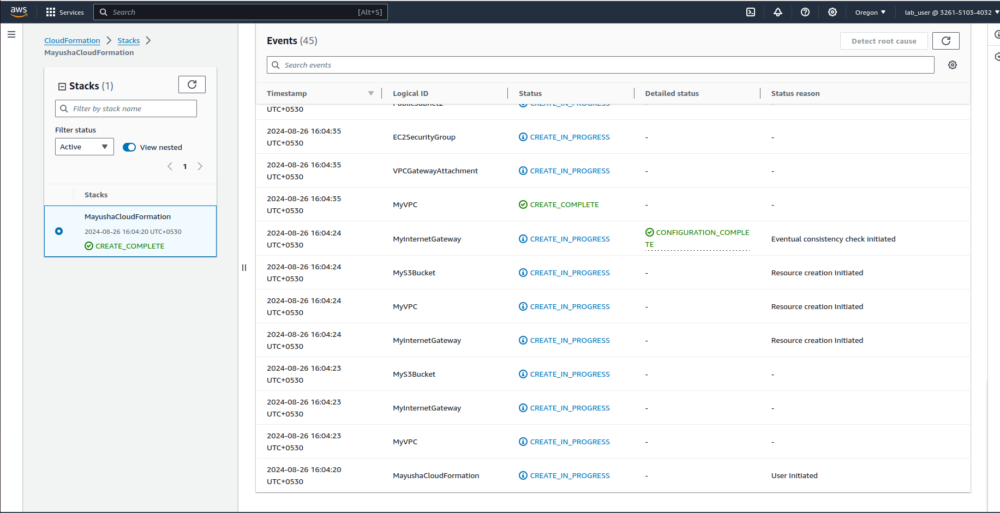

3. **Testing:**
    - VPC and Subnets:

    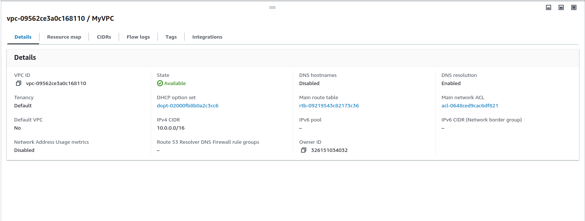

    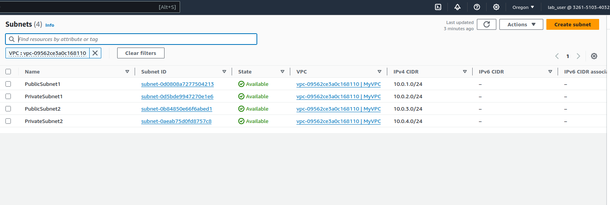
        
    - EC2 Instance:

    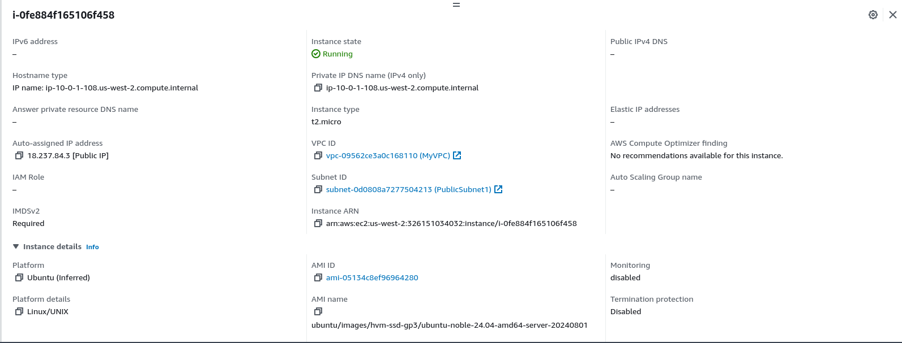
        
    - S3 Bucket:

    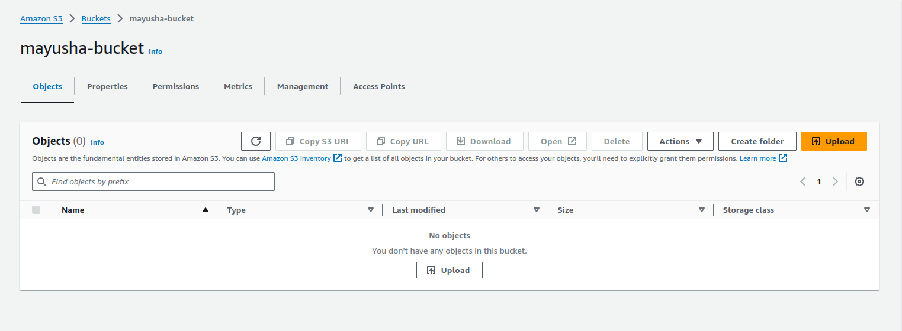
        
    - RDS MySQL DB Instance:

    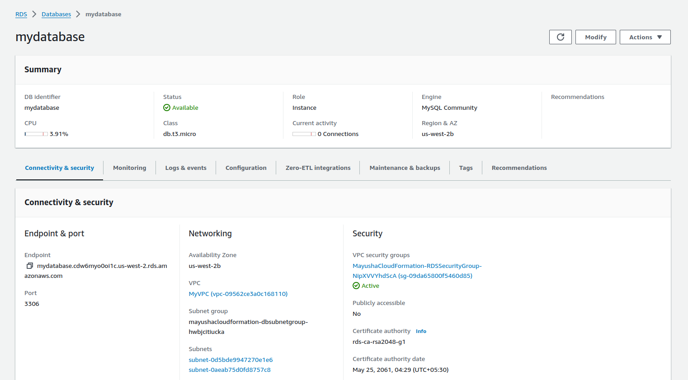
        

4. **Resource Termination:**
    - Once the deployment and testing are complete, terminate all resources by deleting the CloudFormation stack.
    - Ensure that no resources, such as EC2 instances, RDS instances, or S3 buckets, are left running.

    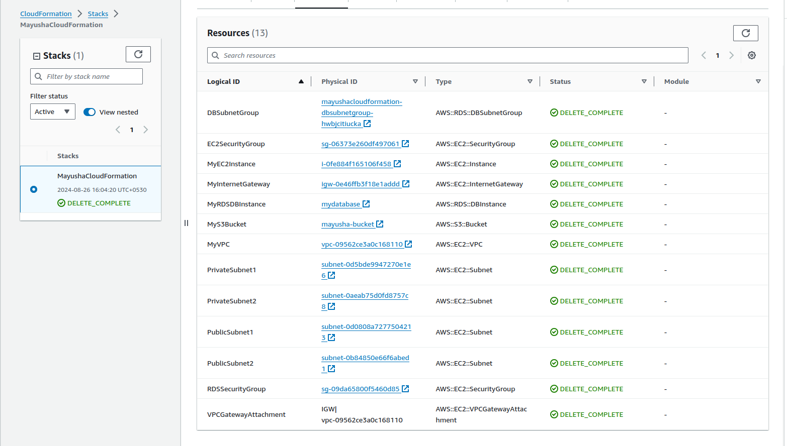