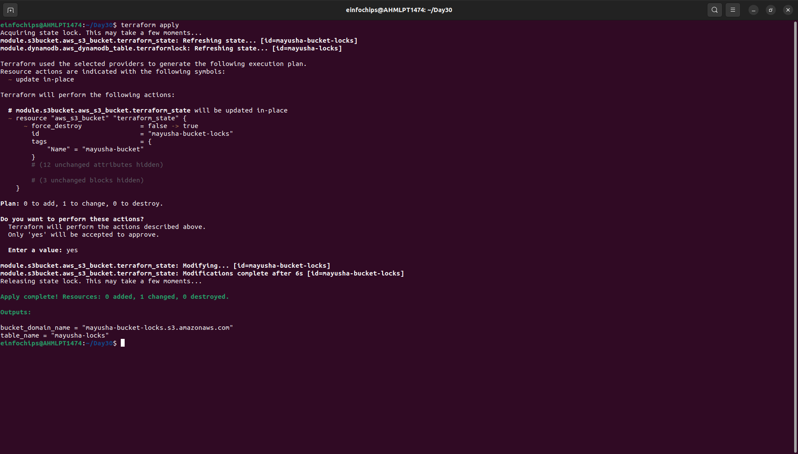
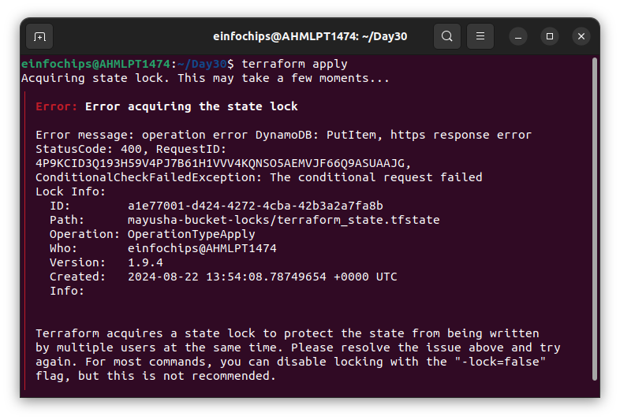

# Project: Deploying a Multi-Tier Architecture Application on AWS using Terraform

### Project Overview:
Write Terraform configuration files to automate the deployment of a multi-tier application on AWS. The architecture should consist of:
+ EC2 Instance: A t2.micro instance serving as the application server.
+ RDS MySQL DB Instance: A t3.micro instance for the database backend.
+ S3 Bucket: For storing static assets or configuration files.

Key Tasks:
1. **Setup Terraform Configuration:**
    -  Provider Configuration:
        -   Configure the AWS provider to specify the region for deployment.
        -   Ensure the region is parameterized using a Terraform variable.

        ```hcl
        terraform {
            required_providers {
                aws = {
                    source = "hashicorp/aws"
                }
            }
        }
        provider "aws" {
            region = var.region_name
        }
        ```

    -  VPC and Security Groups:
        -   Create a VPC with a public subnet for the EC2 instance.
        -   Define security groups allowing HTTP and SSH access to the EC2 instance, and MySQL access to the RDS instance.

        ```hcl 
        resource "aws_vpc" "my_vpc" {
            cidr_block       = "10.0.0.0/16"

            tags = {
                Name = "${var.tag_name}-VPC"
            }
        }
        resource "aws_subnet" "my_subnet" {
            vpc_id     = aws_vpc.my_vpc.id
            cidr_block = "10.0.1.0/24"
            availability_zone = "us-east-2b"
            tags = {
                Name = "${var.tag_name}-subnet"
            }
        }
        resource "aws_subnet" "my_db_subnet" {
            vpc_id     = aws_vpc.my_vpc.id
            cidr_block = "10.0.2.0/24"
            availability_zone = "us-east-2a"
            tags = {
                Name = "${var.tag_name}-subnet"
            }
        }
        resource "aws_security_group" "security_group" {
            vpc_id = aws_vpc.my_vpc.id
            
            ingress {
                from_port = 22
                to_port = 22
                protocol = "tcp" 
                cidr_blocks = ["0.0.0.0/0"]
            }
            ingress {
                from_port = 80
                to_port = 80
                protocol = "tcp"
                cidr_blocks = ["0.0.0.0/0"]
            }    
            tags = {
                Name = "${var.tag_name}-sg"
            }
        }
        resource "aws_security_group" "db_sg" {
            vpc_id = aws_vpc.my_vpc.id

            ingress {
                from_port   = 3306
                to_port     = 3306
                protocol    = "tcp"
                security_groups = [aws_security_group.security_group.id]
            }

            tags = {
                Name = "${var.tag_name}-db-sg"
            }
        }
        ```


    -  EC2 Instance:
        -   Define the EC2 instance using a t2.micro instance type.
        -   Configure the instance to allow SSH and HTTP access.
        -   Use Terraform variables to define instance parameters like AMI ID and instance type.

        ```hcl
        resource "aws_instance" "my_instance" {
            ami           = var.ami_id
            instance_type = var.instance_type
            subnet_id     = aws_subnet.my_subnet.id
            vpc_security_group_ids = [aws_security_group.db_sg.id]

            tags = {
                Name = var.tag_name
            }
        }
        ```

    -  RDS MySQL DB Instance:
        -   Create a t3.micro MySQL DB instance within the same VPC.
        -   Use Terraform variables to define DB parameters like DB name, username, and password.
        -   Ensure the DB instance is publicly accessible, and configure security groups to allow access from the EC2 instance.

        ```hcl
        resource "aws_db_subnet_group" "db_subnet" {
            name       = "${var.tag_name}-db-subnetgroup"
            subnet_ids = [aws_subnet.my_subnet.id, aws_subnet.my_db_subnet.id]

            tags = {
                Name = "${var.tag_name}-db-subnetgroup"
            }
        }
        resource "aws_db_instance" "my_db_instance" {
            allocated_storage    = 10
            db_subnet_group_name = aws_db_subnet_group.db_subnet.id
            vpc_security_group_ids = [aws_security_group.security_group.id]
            db_name              = var.name_db
            engine               = "mysql"
            engine_version       = "8.0"
            instance_class       = "db.t3.micro"
            username             = var.db_user
            password             = var.db_pass
            parameter_group_name = "default.mysql8.0"
            skip_final_snapshot  = true
        }
        ```

    -  S3 Bucket:
        -   Create an S3 bucket for storing static files or configurations.
        -   Allow the EC2 instance to access the S3 bucket by assigning the appropriate IAM role and policy.
        ```hcl
        resource "aws_s3_bucket" "my_bucket" {
            bucket = "${var.tag_name}-bucket"
            tags = {
                Name = "${var.tag_name}-bucket"
            }
        }
        ```

    -  Outputs:
        -   Define Terraform outputs to display the EC2 instance’s public IP address, the RDS instance’s endpoint, and the S3 bucket name.

    


2. **Apply and Manage Infrastructure:**
    -  Initial Deployment:
        -   Run terraform init to initialize the configuration.
        -   Use terraform plan to review the infrastructure changes before applying.
        -   Deploy the infrastructure using terraform apply, and ensure that the application server, database, and S3 bucket are set up correctly.

    

    -  Change Sets:
        -   Make a minor change in the Terraform configuration, such as modifying an EC2 instance tag or changing an S3 bucket policy.
        -   Use terraform plan to generate a change set, showing what will be modified.
        -   Apply the change set using terraform apply and observe how Terraform updates the infrastructure without disrupting existing resources.

    

3. **Resource Termination:**
    - Once the deployment is complete and validated, run terraform destroy to tear down all the resources created by Terraform.
    - Confirm that all AWS resources (EC2 instance, RDS DB, S3 bucket, VPC) are properly deleted.

    