**Git Project (2.5 Hours)** 

**Objective:** 

You will work on a project involving a simple website. You will learn and practice various Git concepts including branching, merging, handling merge conflicts, rebasing, pulling, versioning, and rolling back changes. This project is designed to be completed in 1 hour. 

**Project Setup (15 minutes)** 

1. **Install Git**: Ensure Git is installed on your system. Verify with git --version. 

**Set Up Git**: Configure your Git username and email: 

git config --global user.name "Your Name" 

git config --global user.email "your.email@example.com" 

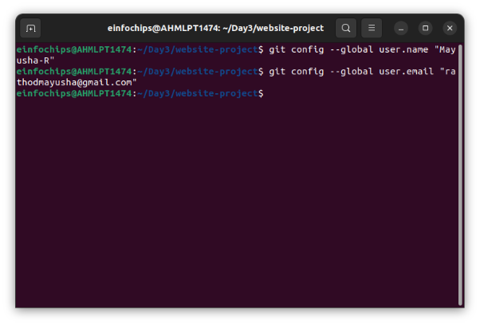

2. **Create a GitHub Repository**: 
- Go to GitHub and create a new repository named website-project. 

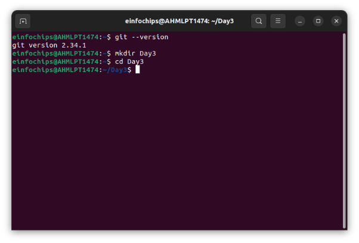

Clone the repository to your local machine: 

git clone https://github.com/your-username/website-project.git 

3. **Initialize the Project**: 

Navigate to the project directory: cd website-project 

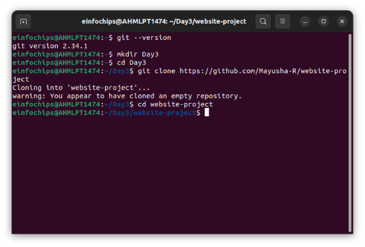

Create initial project structure: 

mkdir src 

touch src/index.html 

echo "<!DOCTYPE html><html><head><title>My Website</title></head><body><h1>Welcome to my website!</h1></body></html>" > src/index.html 

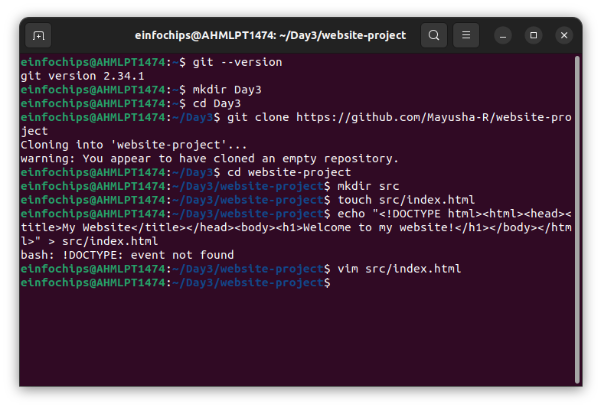

Commit and push the initial project structure: 

git add . 

git commit -m "Initial commit: Added project structure and index.html" git push origin main 

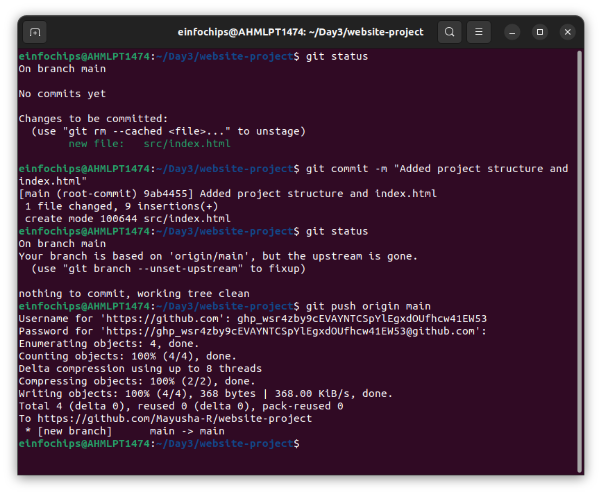

**Exercise 1: Branching and Basic Operations (10 minutes) Create a New Branch**: 

git checkout -b feature/add-about-page 

 
1. **Add a New Page**: 

Create about.html: 

touch src/about.html 

echo "<!DOCTYPE html><html><head><title>About Us</title></head><body><h1>About Us</h1></body></html>" > src/about.html 

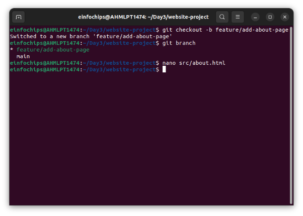

Commit and push changes: 

git add src/about.html 

git commit -m "Added about page" git push origin feature/add-about-page 

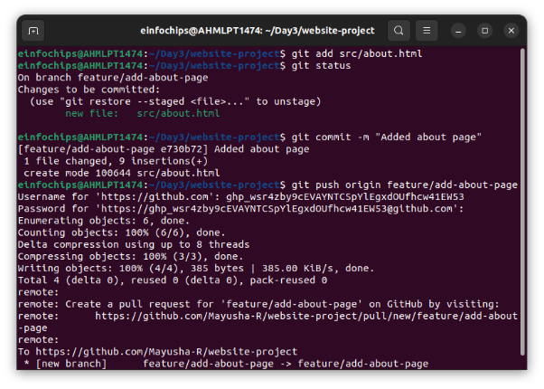

**Exercise 2: Merging and Handling Merge Conflicts (15 minutes) Create Another Branch**: 

git checkout main 

git checkout -b feature/update-homepage 

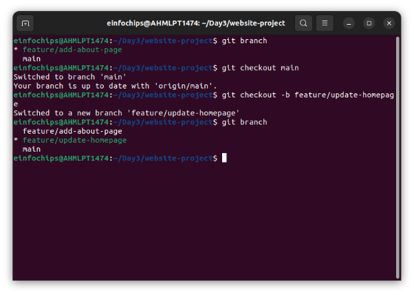

1. **Update the Homepage**: 

Modify index.html: 

echo "
Updated homepage content
" >> src/index.html 

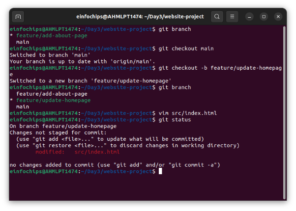

Commit and push changes: 

git add src/index.html 

git commit -m "Updated homepage content" git push origin feature/update-homepage 

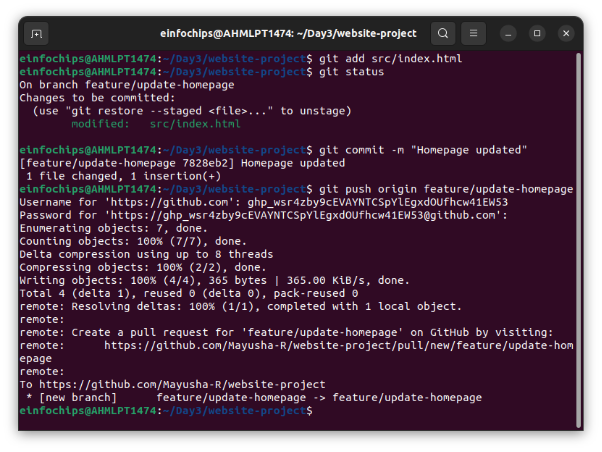

2. **Create a Merge Conflict**: 

Modify index.html on the feature/add-about-page branch: 

git checkout feature/add-about-page 

echo "
Conflict content
" >> src/index.html 

git add src/index.html 

git commit -m "Added conflicting content to homepage" git push origin feature/add-about-page 

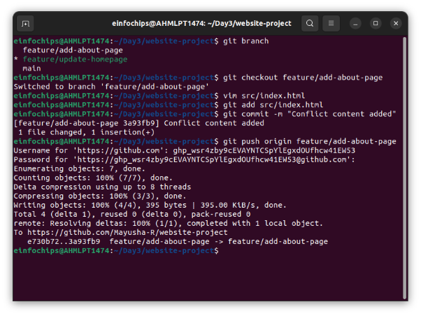

3. **Merge and Resolve Conflict**: 

Attempt to merge feature/add-about-page into main: 

git checkout main 

git merge feature/add-about-page 

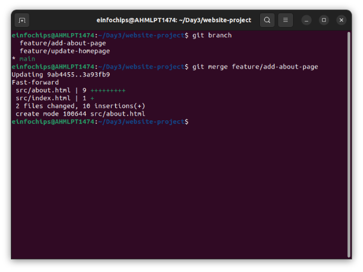

there was no conflict here. Fast-forwarding used instead. Resolve the conflict in src/index.html, then: 

git add src/index.html 

git commit -m "Resolved merge conflict in homepage" git push origin main 

**Exercise 3: Rebasing (10 minutes)** 

1\.  **Rebase a Branch**: 

Rebase feature/update-homepage onto main: 

git checkout feature/update-homepage git rebase main 

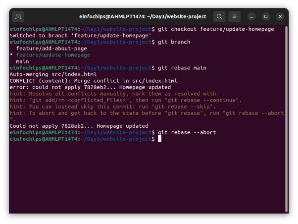

- Resolve any conflicts that arise during rebase. 

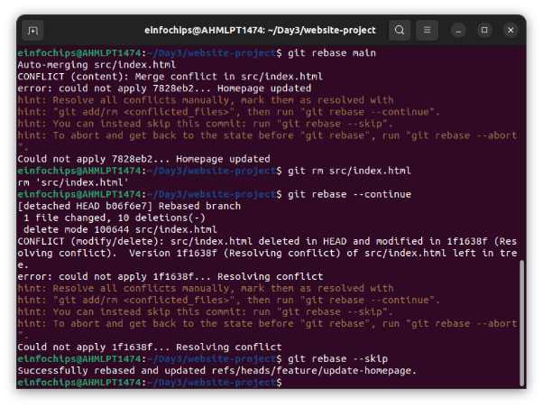

**Push the Rebased Branch**: 

git push -f origin feature/update-homepage 

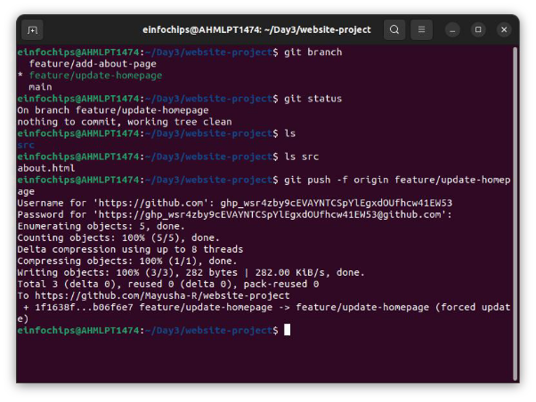

**Exercise 4: Pulling and Collaboration (10 minutes) ![ref1]**

1. **Pull Changes from Remote**: 

Ensure the main branch is up-to-date: 

git checkout main git pull origin main 

 
2. **Simulate a Collaborator's Change**: 
- Make a change on GitHub directly (e.g., edit index.html). 

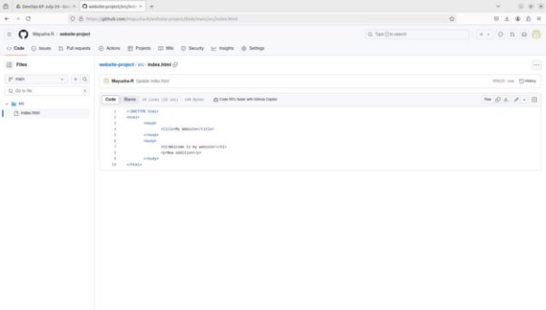

3. **Pull Collaborator's Changes**: 

Pull the changes made by the collaborator: 

git pull origin main 

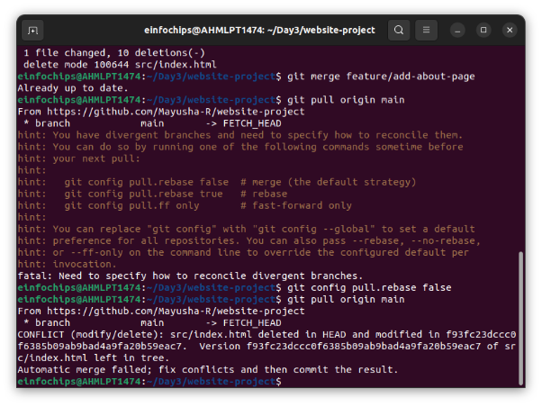

**Exercise 5: Versioning and Rollback (15 minutes) ![ref1]**

1. **Tagging a Version**: 

Tag the current commit as v1.0: 

git tag -a v1.0 -m "Version 1.0: Initial release" git push origin v1.0 

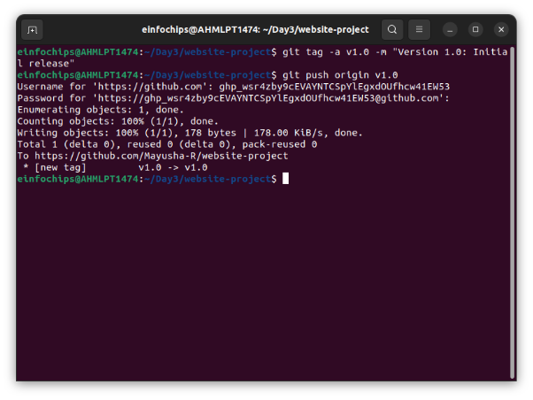

2. **Make a Change that Needs Reversion**: 

Modify index.html: 

echo "
Incorrect update
" >> src/index.html git add src/index.html 

git commit -m "Incorrect update" 

git push origin main 

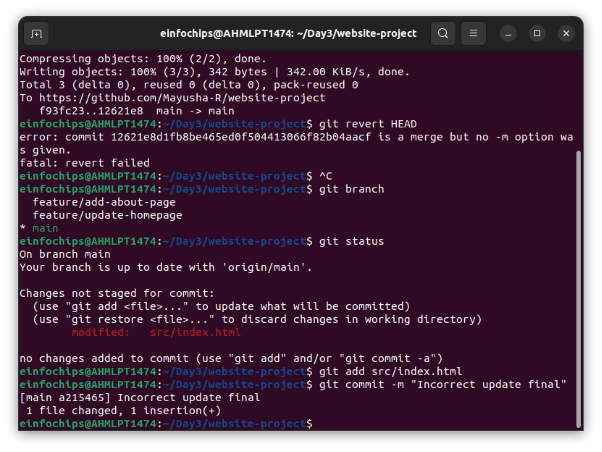

3. **Revert to a Previous Version**: 

Use git revert to undo the last commit: 

git revert HEAD 

git push origin main 

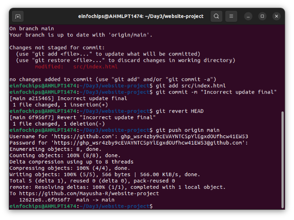

Alternatively, reset to a specific commit (use with caution): sh 

Copy code 

git reset --hard v1.0 

git push -f origin main 

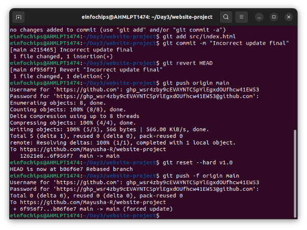

**Extra Activities (10 minutes) ![ref1]**

1. **Stashing Changes**: 

Make some local changes without committing: 

echo "
Uncommitted changes
" >> src/index.html   

Stash the changes: 

git stash 

 

Apply the stashed changes: git stash apply 

2. **Viewing Commit History**: 

Use git log to view commit history: 

git log --oneline 

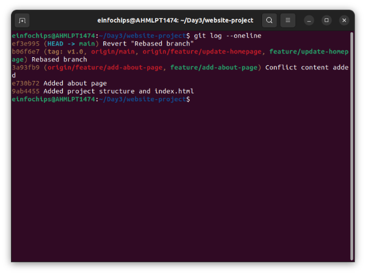

[ref1]: Aspose.Words.8791e823-f862-4937-99d7-60b70e34051a.020.png
