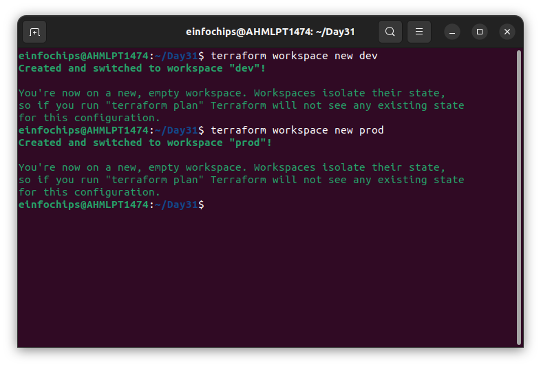
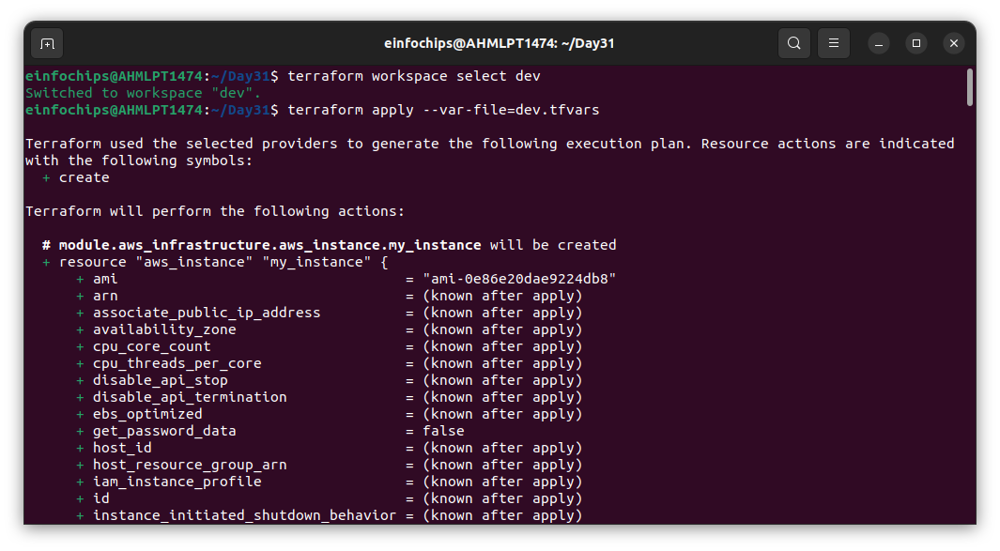
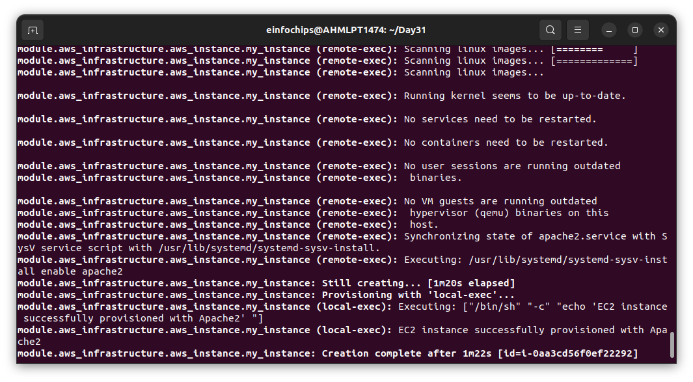
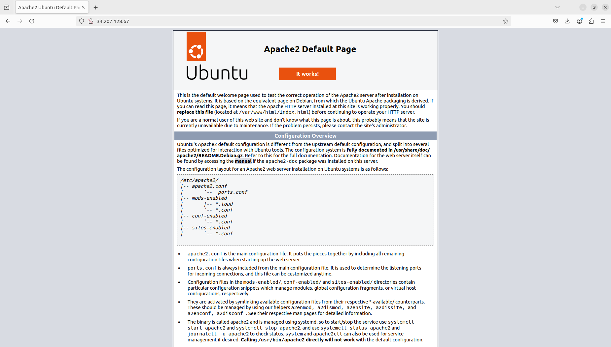
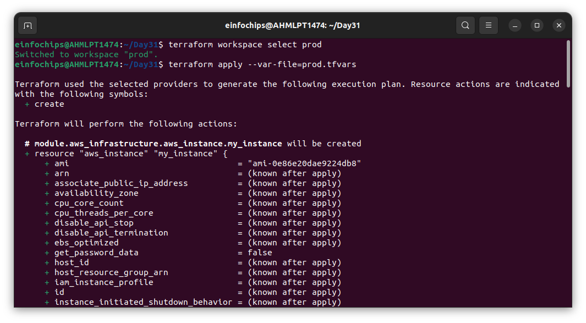
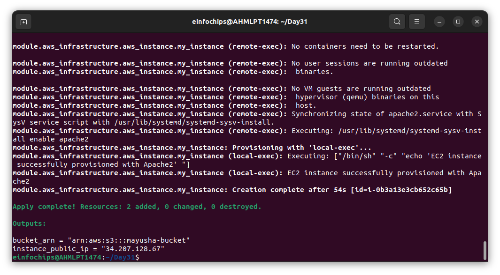

# Project: Advanced Terraform with Modules, Functions, State Locks, Remote State Management, and Variable Configuration
### Project Objective:
This project will test your skills in using Terraform modules, functions, variables, state locks, and remote state management. The project requires deploying infrastructure on AWS using a custom Terraform module and managing the state remotely in an S3 bucket, while testing the locking mechanism with DynamoDB. Participants will also configure variables and outputs using functions.
### Project Overview:
You will create a Terraform configuration that uses a custom module to deploy a multi-component infrastructure on AWS. The state files will be stored remotely in an S3 bucket, and DynamoDB will handle state locking. Additionally, the project will involve creating a flexible and reusable Terraform module, using input variables (tfvars) and Terraform functions to parameterize configurations.

**Key Tasks:**
1. **Remote State Management:**
    - S3 Bucket for State:
        - Create an S3 bucket using Terraform (this can be separate from the custom module).
        - Configure Terraform to store the state file in the S3 bucket.
    - State Locking with DynamoDB:
        - Create a DynamoDB table using Terraform (or manually if required) to store the state lock information.
        - Configure Terraform to use this DynamoDB table for state locking.
2. **Terraform Module Creation:**
    - Custom Module:
        - Create a Terraform module to deploy the following AWS resources:
            • S3 bucket: Create an S3 bucket for application data.

        
        
        - Use Terraform variables (txvars) to parameterize important aspects such as:
            • Region: Parameterize the AWS region so that the module can be reused across regions.
            • Bucket Name: Use a variable to set the S3 bucket name.
    
3. **Input Variables and Configuration (txvars):**
    - Define input variables to make the infrastructure flexible:
        - S3 bucket name.
        - AWS region.
        - Any other variable relevant to the infrastructure.
    - Use the default argument for variables where appropriate.
4. **Output Configuration:**
    - Set up Terraform outputs to display key information after the infrastructure is created:
        - S3 Bucket Name: Output the name of the S3 bucket created.
        - Region: Output the region where the resources were deployed.
5. **Testing State Locking and Remote State:**
    - State Locking:
        - Attempt to run terraform apply from two different terminals simultaneously to test state locking.
        - Confirm that DynamoDB properly handles the state lock, preventing concurrent updates.

    

    - Remote State Management:
        - Verify that Terraform state is being stored in the S3 bucket and that updates are reflected in the remote state file.

    

    

6. **Apply and Modify Infrastructure:**
    - Initial Deployment:
        - Use terraform plan and terraform apply to deploy the infrastructure.

    

    - Infrastructure Changes:
        - Modify one of the variables and re-run terraform apply.
        - Observe how Terraform plans and applies only the necessary changes, with state locking in effect.

    

7. **Resource Termination:**
    - Once the deployment is complete and tested, use terraform destroy to tear down all the resources created by Terraform.
    - Ensure that the S3 bucket, EC2 instance, and DynamoDB table (if not reused) are deleted.

    