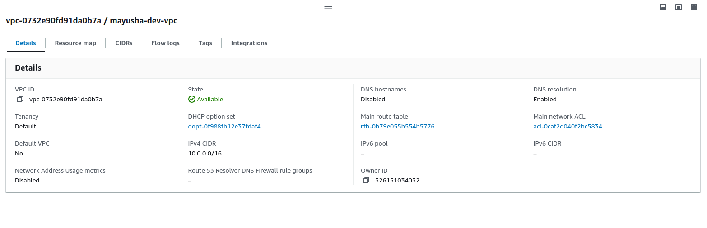
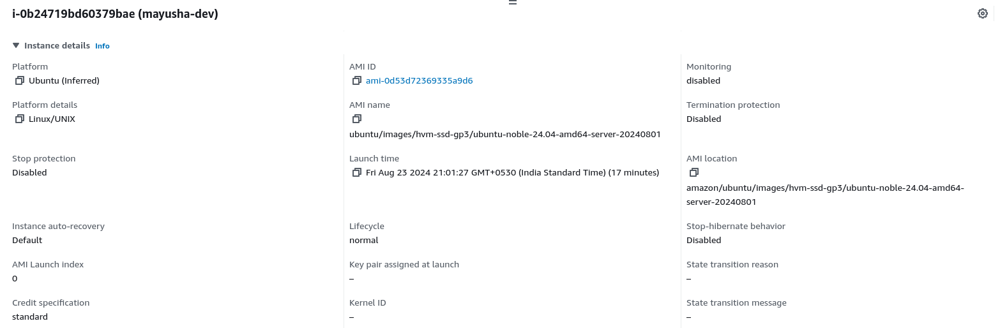
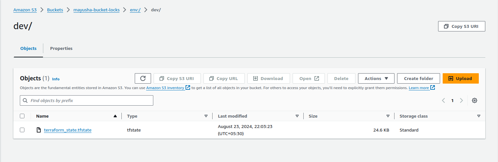
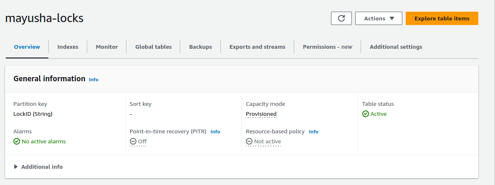
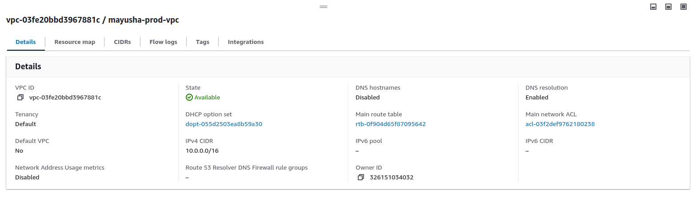
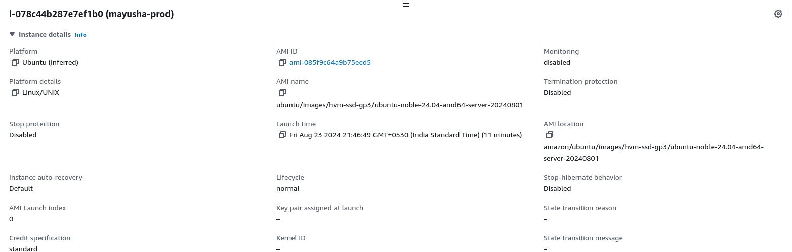
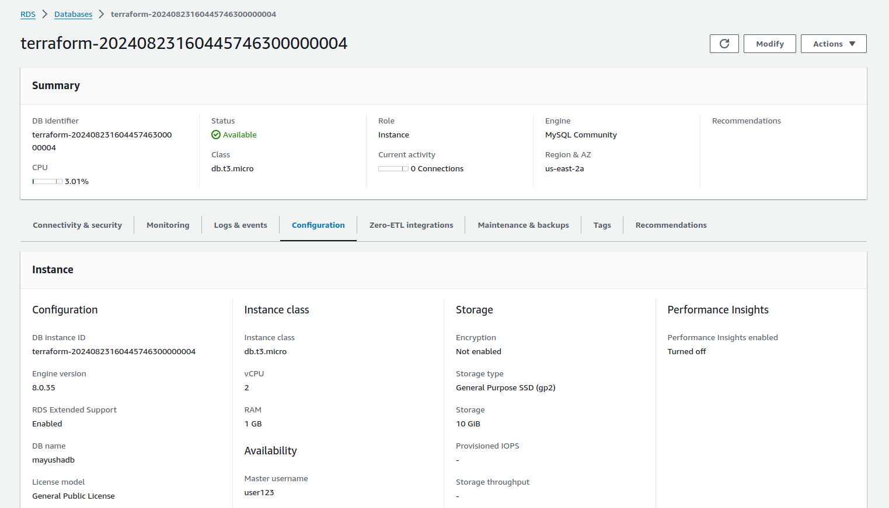
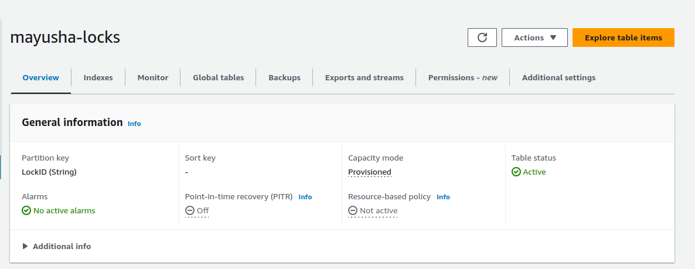

# Automation (IaaC) Terraform on AWS Assessment Project

## Project Overview

This capstone project is designed to assess participants' knowledge and practical skills with Terraform, specifically focusing on AWS. The project will require deploying a complete infrastructure using Terraform, emphasizing the usage of state lock, variables, .tfvars files, modules, functions, workspaces, and lifecycle rules. The deployment will be restricted to AWS Free Tier resources to avoid unnecessary costs.

## Project Objectives

- Deploy a multi-tier architecture on AWS using Terraform.
- Implement state locking to manage concurrent changes.
- Use variables and .tfvars files to parameterize configurations.
- Create and use Terraform modules to promote reusability and organization.
- Utilize functions to dynamically configure resources.
- Manage multiple environments using Terraform workspaces.
- Implement lifecycle rules to control resource creation, updates, and deletion.

## Project Requirements

1. **Infrastructure Design**

    The project will involve deploying a basic 3-tier web application architecture, which includes the following components:
    - VPC: Create a Virtual Private Cloud (VPC) with public and private subnets across two availability zones.
    - Security Groups: Define security groups to control inbound and outbound traffic for the application and database tiers.
    - EC2 Instances: Deploy EC2 instances in the public subnets for the web servers (Application Tier).
    - RDS Instance: Deploy an RDS MySQL instance in the private subnet for the database (Database Tier).
    - S3 Bucket: Create an S3 bucket to store static files, with versioning enabled.

    
    
2. **Terraform State Management**
    - Implement remote state storage using an S3 bucket to store the Terraform state file.
    - Use DynamoDB for state locking to prevent concurrent modifications.

      - backend.tf

        ```hcl
        terraform {
            backend "s3" {
                bucket         = "mayusha-bucket-locks"
                key            = "terraform_state.tfstate"         
                region         = "us-west-1"
                dynamodb_table = "mayusha-locks"
            }
        }

        ```

3. **Variables and tfvars**
    - Define input variables for resources like VPC CIDR, instance types, database username/password, and S3 bucket names.
        - VPC:

          - module/vpc/variables.tf:

            ```hcl

            variable "tag_name" {
                description = "The custom name to use"
                type        = string
            }
            variable "region_name" {
                description = "The AWS region used"
                type        = string
            }

            ```

        - EC2:

          - module/ec2/variables.tf:

            ```hcl

            variable "ami_id" {
                description = "AMI ID used to create instance"
                type        = string
            }
            variable "instance_type" {
                description = "Type of instance to use"
                type        = string
                default     = "t2.micro"
            }
            variable "tag_name" {
                description = "The custom name to use"
                type        = string
            }
            variable "instance_subnet" {
                description = "The instance subnet"
                type        = string
            }

            variable "instance_sg" {
                description = "The instance security group"
                type        = string
            }

            ```

        - RDS:

          - module/rds/variables.tf:

            ```hcl

            variable "tag_name" {
                description = "The custom name to use"
                type        = string
            }

            variable "db_user" {
                description = "The user name"
                type        = string
                default     = "<username>"
            }

            variable "db_pass" {
                description = "The password for that user"
                type        = string
                default     = "<password>"
            }

            variable "name_db" {
                description = "The db name to create"
                type        = string
                default     = "mayushadb"
            }

            variable "rds_subnet_group"{
                description = "The db subnet group"
                type        = string
            }

            variable "rds_sg" {
                description = "The db security group"
                type        = string
            }
            ```

        - S3 Bucket:

          - module/s3bucket/variables.tf:

            ```hcl

            variable "bucket_name" {
                description = "The name of the S3 bucket"
                type        = string
                default     = "mayusha-bucket-locks"
            }
            variable "tag_name" {
                description = "The custom name to use"
                type        = string
            }

            ```

    
    - Use .tfvars files to pass different configurations for environments (e.g., dev.tfvars, prod.tfvars).

        - Workspace "dev":

          - dev.tfvars:

            ```hcl 

            tag_name = "mayusha-dev"
            region_name = "us-west-1"
            aws_profile = "dev"
            ami_id = "ami-0d53d72369335a9d6"

            ```
        - Workspace "prod":

          - prod.tfvars:

            ```hcl 

            tag_name = "mayusha-prod"
            ami_id = "ami-085f9c64a9b75eed5"
            region_name = "us-east-2"
            aws_profile = "prod"

            ```


4. **Modules**
    - Break down the infrastructure into reusable modules:
        - VPC Module: Manage VPC, subnets, and routing tables.

          - module/vpc/main.tf:

            ```hcl

            resource "aws_vpc" "my_vpc" {
                cidr_block = "10.0.0.0/16"

                tags = {
                    Name = "${var.tag_name}-vpc"
                }
            }
            resource "aws_subnet" "my_subnet" {
                vpc_id     = aws_vpc.my_vpc.id
                cidr_block = "10.0.1.0/24"
                availability_zone = "${var.region_name}b"
                tags = {
                    Name = "${var.tag_name}-subnet"
                }
            }
            resource "aws_subnet" "my_db_subnet" {
                vpc_id     = aws_vpc.my_vpc.id
                cidr_block = "10.0.2.0/24"
                availability_zone = "${var.region_name}a"
                tags = {
                    Name = "${var.tag_name}-subnet"
                }
            }
            resource "aws_security_group" "security_group" {
                vpc_id = aws_vpc.my_vpc.id
                
                ingress {
                    from_port = 22
                    to_port = 22
                    protocol = "tcp" 
                    cidr_blocks = ["0.0.0.0/0"]
                }
                ingress {
                    from_port = 80
                    to_port = 80
                    protocol = "tcp"
                    cidr_blocks = ["0.0.0.0/0"]
                }    
                tags = {
                    Name = "${var.tag_name}-sg"
                }
            }
            resource "aws_security_group" "db_sg" {
                vpc_id = aws_vpc.my_vpc.id

                ingress {
                    from_port   = 3306
                    to_port     = 3306
                    protocol    = "tcp"
                    security_groups = [aws_security_group.security_group.id]
                }

                tags = {
                    Name = "${var.tag_name}-db-sg"
                }
            }

            resource "aws_db_subnet_group" "db_subnet" {
                name       = "mayusha-db-subnetgroup"
                subnet_ids = [aws_subnet.my_subnet.id, aws_subnet.my_db_subnet.id]

                tags = {
                    Name = "${var.tag_name}-db-subnetgroup"
                }
            }

            ```

        - EC2 Module: Configure and launch EC2 instances.

          - module/ec2/main.tf:
            ```hcl

            resource "aws_instance" "my_instance" {
                ami           = var.ami_id
                instance_type = var.instance_type
                subnet_id     = var.instance_subnet
                vpc_security_group_ids = [var.instance_sg]
                lifecycle {
                    create_before_destroy = true
                }
                tags = {
                    Name = var.tag_name
                }
            }

            ```

        - RDS Module: Set up the RDS MySQL database.

          - module/rds/main.tf:

            ```hcl

            resource "aws_db_instance" "my_db_instance" {
                allocated_storage    = 10
                db_subnet_group_name = var.rds_subnet_group
                vpc_security_group_ids = [var.rds_sg]
                db_name              = var.name_db
                engine               = "mysql"
                engine_version       = "8.0"
                instance_class       = "db.t3.micro"
                username             = var.db_user
                password             = var.db_pass
                parameter_group_name = "default.mysql8.0"
                skip_final_snapshot  = true
                tags = {
                    Name = var.tag_name
                }
            }

            ```

        - S3 Module: Handle S3 bucket creation with versioning.

          - module/s3bucket/main.tf:

            ```hcl

            resource "aws_s3_bucket" "terraform_state" {
                bucket = var.bucket_name
                force_destroy = true

                tags = {
                    Name = "${var.tag_name}-bucket"
                }
            }

            ```


5. **Workspaces**
    - Create workspaces for different environments (e.g., development, staging, production).

    

    - Deploy the infrastructure in each environment using the appropriate workspace.

6. **Lifecycle Rules**
    - Implement lifecycle rules to:
        - Prevent resource deletion: Ensure certain resources, like the RDS database, are not accidentally deleted (prevent_destroy).
        - Ignore changes to specific resource attributes (e.g., S3 bucket tags) using ignore_changes.

### Project Steps

1. **Setup Remote State and Locking**

    - Create an S3 bucket for storing Terraform state.
    - Create a DynamoDB table for state locking.
    - Configure the backend in Terraform to use the S3 bucket and DynamoDB table.

2. **Develop and Organize Modules**

    - Develop separate modules for VPC, EC2, RDS, S3, and IAM.
    - Place each module in a separate directory with main.tf, variables.tf, and outputs.tf.

3. **Define Variables and tfvars Files**

    - Define variables in variables.tf files within each module.
    - Create a terraform.tfvars file with default values.
    - Create separate environment-specific .tfvars files (e.g., dev.tfvars, prod.tfvars).

4. **Implement Workspaces**

    - Initialize Terraform and create workspaces (development, staging, production).

    

    - Deploy infrastructure in each workspace using the appropriate .tfvars file.

5. **Deploy the Infrastructure**

    - Use the terraform apply command to deploy the infrastructure in each workspace.
    - Verify the deployment by accessing the EC2 instances and ensuring the application is running.

6. **Implement Lifecycle Rules**

    - Modify the Terraform code to add lifecycle rules for critical resources.
    - Apply the changes and verify that the lifecycle rules are in effect.

7. **Cleanup**

    - Destroy the infrastructure in each workspace using terraform destroy.
    - Ensure that resources marked with prevent_destroy are not deleted.

    


## Output

#### Dev Workspace:

1. VPC:

    

2. EC2 Instance:

    

3. RDS Instance:

    

4. S3 Bucket:

    

5. Dynamodb Table:

    


#### Prod Workspace:

1. VPC:

    

2. EC2 Instance:

    

3. RDS Instance:

    


4. S3 Bucket:

    

5. Dynamodb Table:

    

