# Deploying a Kubeadm Cluster

## Part 1: Kubeadm

### 1. Launch AWS Instances

- **Create Instances:** 

    - Control Plane:

        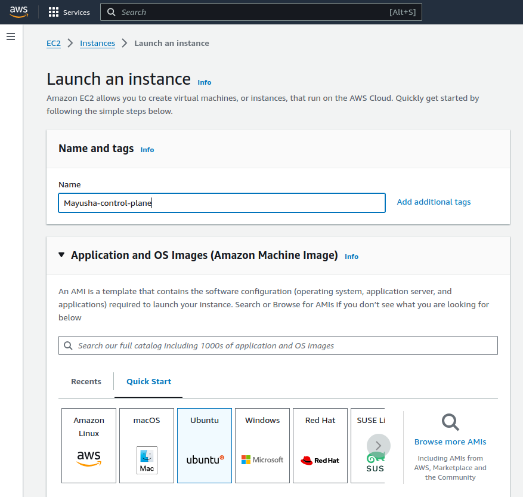

        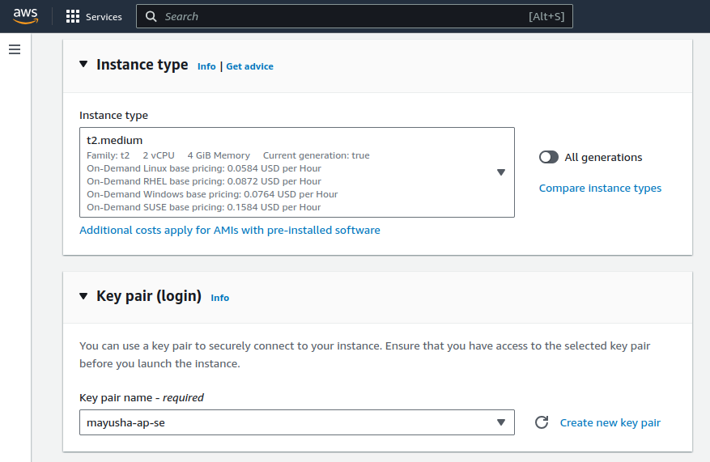

        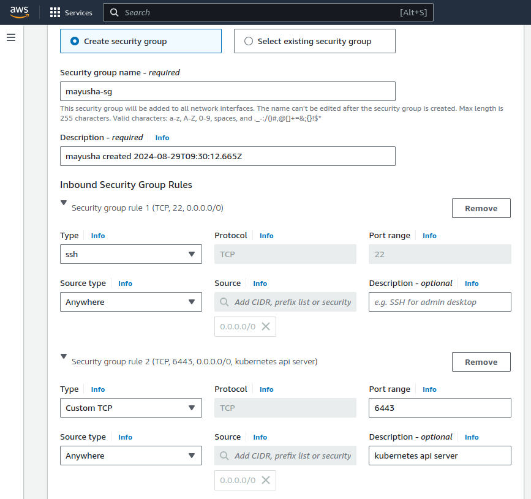

        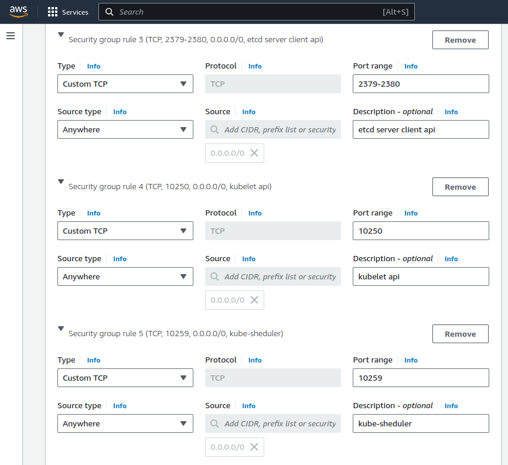

        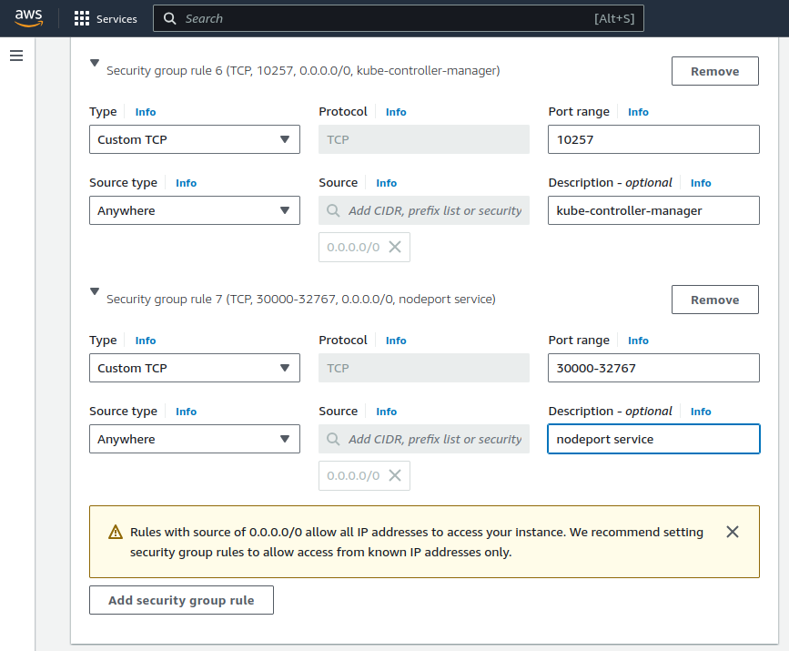

        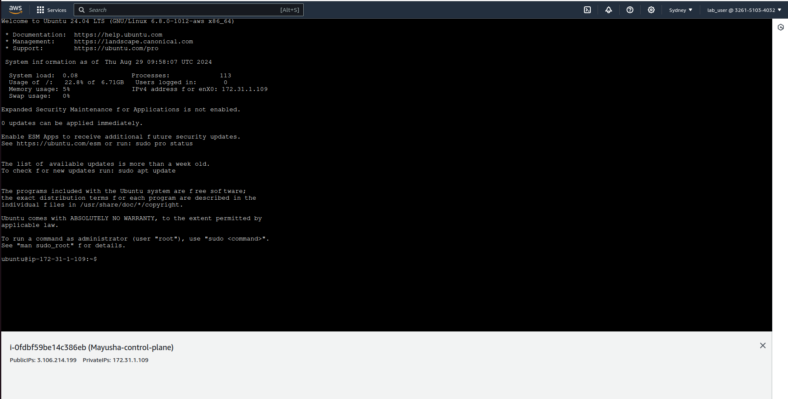

    - Worker:

        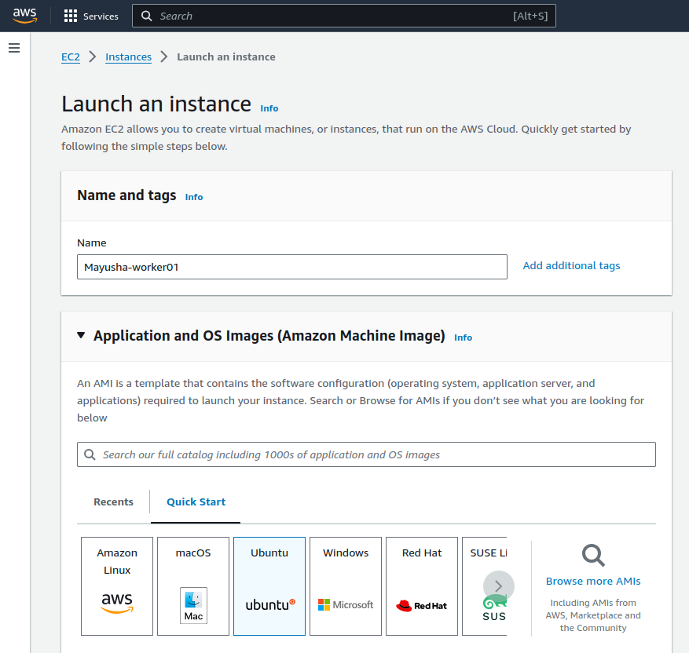

        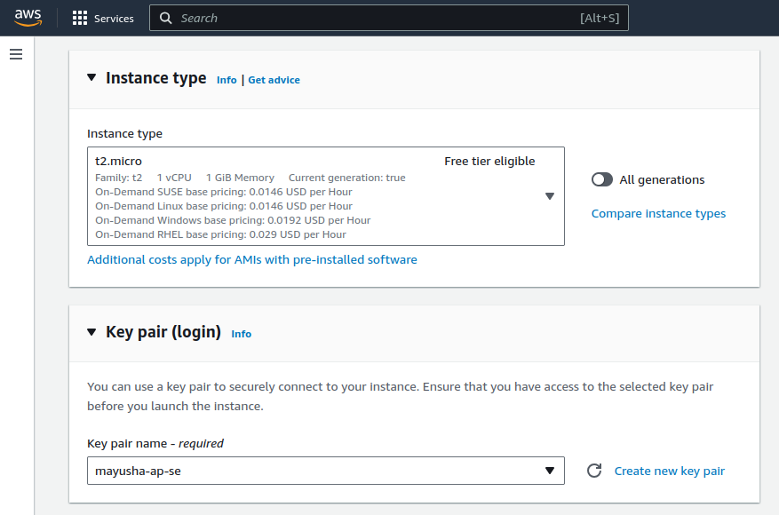

        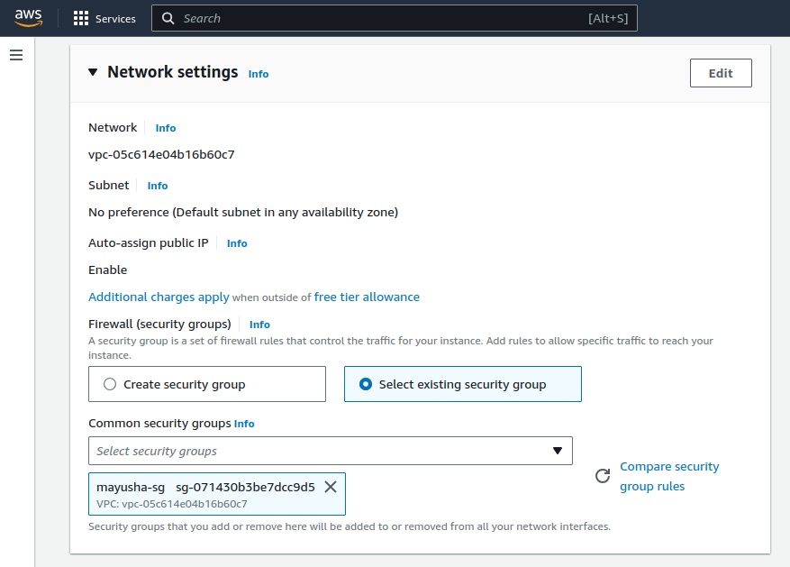

        


### 2. Set Up the Kubernetes Cluster

#### For all nodes (worker and control plane):

1. disable swap
    ```bash
    sudo swapoff -a
    sudo sed -i '/swap/s/^/#/' /etc/fstab
    ```

2. Create the .conf file to load the modules at bootup
    ```bash
    cat <<EOF | sudo tee /etc/modules-load.d/k8s.conf
    overlay
    br_netfilter
    EOF
    ```
    ```bash
    sudo modprobe overlay
    sudo modprobe br_netfilter
    ```

3. sysctl params required by setup, params persist across reboots
    ```bash
    cat <<EOF | sudo tee /etc/sysctl.d/k8s.conf
    net.bridge.bridge-nf-call-iptables  = 1
    net.bridge.bridge-nf-call-ip6tables = 1
    net.ipv4.ip_forward                 = 1
    EOF
    ```

4. Apply sysctl params without reboot
    ```bash
    sudo sysctl --system
    ```

5. Update the package repository 
    ```bash
    sudo apt-get update
    ```
6. Install Containerd
    ```bash
    sudo apt update -y ; sudo apt-get install containerd -y
    sudo mkdir -p /etc/containerd
    containerd config default | sudo tee /etc/containerd/config.toml 
    sudo sed -i "s/SystemdCgroup = false/SystemdCgroup = true/g" /etc/containerd/config.toml 
    sudo systemctl restart containerd
    ```

7. Update the apt package index and install packages needed to use the Kubernetes apt repository:
    ```bash
    sudo apt-get update
    ```
8. apt-transport-https may be a dummy package; if so, you can skip that package
    ```bash
    sudo apt-get install -y apt-transport-https ca-certificates curl gpg
    ```
9. Download the public signing key for the Kubernetes package repositories. The same signing key is used for all repositories so you can disregard the version in the URL:
If the directory `/etc/apt/keyrings` does not exist, it should be created before the curl command, read the note below.
    ```bash
    sudo mkdir -p -m 755 /etc/apt/keyrings
    ```
    ```bash
    curl -fsSL https://pkgs.k8s.io/core:/stable:/v1.30/deb/Release.key | sudo gpg --dearmor -o /etc/apt/keyrings/kubernetes-apt-keyring.gpg
    ```
10. This overwrites any existing configuration in /etc/apt/sources.list.d/kubernetes.list
    ```bash
    echo 'deb [signed-by=/etc/apt/keyrings/kubernetes-apt-keyring.gpg] https://pkgs.k8s.io/core:/stable:/v1.30/deb/ /' | sudo tee /etc/apt/sources.list.d/kubernetes.list
    ```
11. Update the apt package index, install kubelet, kubeadm and kubectl, and pin their version:
    ```bash
    sudo apt-get update
    sudo apt-get install -y kubelet kubeadm kubectl
    sudo apt-mark hold kubelet kubeadm kubectl
    ```

#### For Control Plane:

1. Initiate the Cluster
    ```bash
    kubeadm init --pod-network-cidr 192.168.0.0/16
    ```

2. To start using your cluster
    ```bash
    mkdir -p $HOME/.kube
    sudo cp -i /etc/kubernetes/admin.conf $HOME/.kube/config
    sudo chown $(id -u):$(id -g) $HOME/.kube/config
    ```

3. Install the Calico Network Add-On
    ```bash
    kubectl apply -f https://raw.githubusercontent.com/projectcalico/calico/v3.25.0/manifests/calico.yaml
    ```

**Verify Cluster Status**:
   ```bash
   kubectl get nodes
   ```

   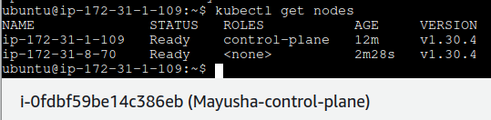


## Part 2: Grafana

1. Install the prerequisite packages:

    ```bash
    sudo apt-get install -y apt-transport-https software-properties-common wget
    ```

2. Import the GPG key:

    ```bash
    sudo mkdir -p /etc/apt/keyrings/

    wget -q -O - https://apt.grafana.com/gpg.key | gpg --dearmor | sudo tee /etc/apt/keyrings/grafana.gpg > /dev/null
    ```


3. To add a repository for stable releases, run the following command:

    ```bash
    echo "deb [signed-by=/etc/apt/keyrings/grafana.gpg] https://apt.grafana.com stable main" | sudo tee -a /etc/apt/sources.list.d/grafana.list
    ```

4. Run the following command to update the list of available packages:

    ```bash
    sudo apt-get update
    ```

5. To install Grafana OSS, run the following command:

    ```bash
    sudo apt-get install grafana
    ```

6. Verify installation 

    ```bash
    grafana-cli --version
    ```

    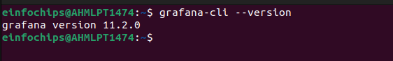

7. Now once it get installed start the server using

    ```bash
    sudo systemctl start grafana-server.service
    ```

8. And Then verify using 

    ```bash
    sudo systemctl status grafana-server.service
    ```

    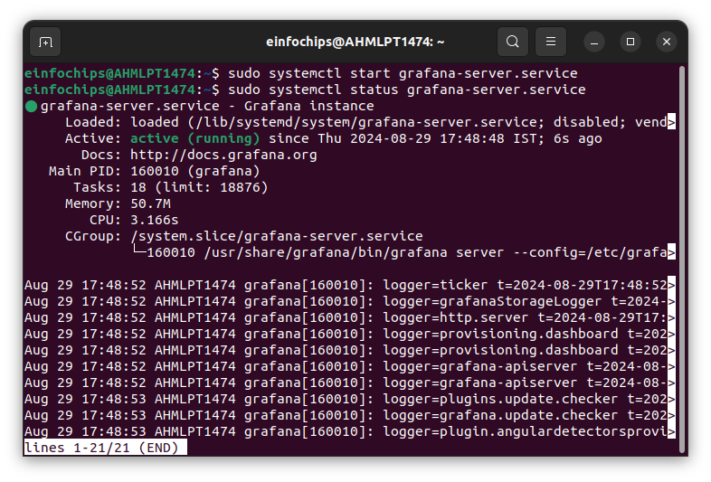


9. Then redirect to http://localhost:3000 to see running grafana

    

    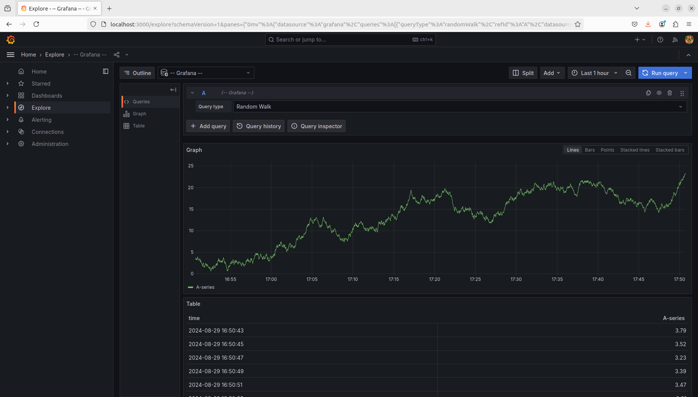
