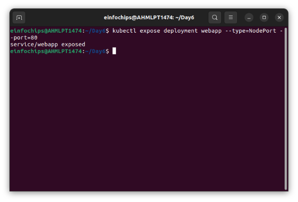

**Project 01 - 1 Hour** 

**Deploying a Scalable Web Application with Persistent Storage and Advanced Automation** 

**Objective:** 

Deploy a scalable web application using Docker Swarm and Kubernetes, ensuring data persistence using a single shared volume, and automate the process using advanced shell scripting. 

**Overview:** 

1. **Step 1**: Set up Docker Swarm and create a service. 
1. **Step 2**: Set up Kubernetes using Minikube. 
1. **Step 3**: Deploy a web application using Docker Compose. 
1. **Step 4**: Use a single shared volume across multiple containers. 
1. **Step 5**: Automate the entire process using advanced shell scripting. 

**Step 1: Set up Docker Swarm and Create a Service** 

1. **Initialize Docker Swarm** 
- Initialize Docker Swarm docker swarm init 
2. **Create a Docker Swarm Service** 
- Create a simple Nginx service in Docker Swarm 

docker service create --name nginx-service --publish 8080:80 nginx 

**Step 2: Set up Kubernetes Using Minikube** 

1. **Start Minikube** 
- Start Minikube minikube start 

  

2. **Deploy a Web App on Kubernetes** 

Create a deployment file named webapp-deployment.yaml: 

apiVersion: apps/v1 kind: Deployment metadata: 

`  `name: webapp spec: 

`  `replicas: 3 

`  `selector: 

`    `matchLabels: 

`      `app: webapp 

`  `template: 

`    `metadata: 

`      `labels: 

`        `app: webapp 

`    `spec: 

`      `containers: 

- name: webapp 

`        `image: nginx 

`      `ports: 

- containerPort: 80 

Apply the deployment: 

kubectl apply -f webapp-deployment.yaml 

3. **Expose the Deployment** 

kubectl expose deployment webapp --type=NodePort --port=80 

**Step 3: Deploy a Web Application Using Docker Compose** 

1. **Create a docker-compose.yml File**

version: '3' 

services: 

`  `web: 

`    `image: nginx 

`    `ports: 

- "8080:80" 

`    `volumes: 

- webdata:/usr/share/nginx/html 

volumes:   webdata: 

2. **Deploy the Web Application** 
- Deploy using Docker Compose docker-compose up -d 

  **Step 4: Use a Single Shared Volume Across Multiple Containers** 

1. **Update docker-compose.yml to Use a Shared Volume**

version: '3' 

services: 

`  `web1: 

`    `image: nginx 

`    `ports: 

- "8081:80" 

`    `volumes: 

- shareddata:/usr/share/nginx/html 

`  `web2: 

`    `image: nginx 

`    `ports: 

- "8082:80" 

`    `volumes: 

- shareddata:/usr/share/nginx/html 

volumes: 

`  `shareddata: 

2. **Deploy with Docker Compose** 
- Deploy using Docker Compose docker-compose up -d 

  **Step 5: Automate the Entire Process Using Advanced Shell Scripting** 

1. **Create a Shell Script deploy.sh** #!/bin/bash 
- Initialize Docker Swarm docker swarm init 
- Create Docker Swarm Service 

  docker service create --name nginx-service --publish 8080:80 nginx 

- Start Minikube minikube start 
- Create Kubernetes Deployment 

  kubectl apply -f webapp-deployment.yaml 

- Expose the Deployment 

kubectl expose deployment webapp --type=NodePort --port=80 

- Deploy Web App Using Docker Compose docker-compose -f docker-compose-single-volume.yml up -d 

  echo "Deployment completed successfully!" 

2. **Make the Script Executable** 
- Make the script executable chmod +x deploy.sh 
3. **Run the Script** 
- Run the deployment script ./deploy.sh 
